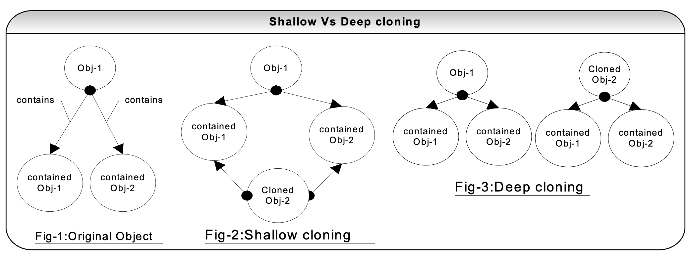

Java
====

Java 8 Features
-------------

- **Lambda Expressions** : They enable you to treat functionality as a method argument, or code as data. Lambda expressions let you express instances of single-method interfaces (referred to as functional interfaces) more compactly.
- **Method references** : Method references provide easy-to-read lambda expressions for methods that already have a name.
- **Pipelines and Streams** New stream API to facilitate pipeline processing.
- **Functional interfaces** : An Interface that contains only one abstract method is known as functional interface. It can have any number of default and static methods. It can also declare methods of object class.
- **Date and Time API**: Date and Time API give us a  new package java.time package.
- **Default Methods:** Default methods enable new functionality to be added to the interfaces of libraries and ensure binary compatibility with code written for older versions of those interfaces.
- **Type Annotations**: Before Java 8 Java annotations can be applied to type declarations. From this Java 8 release onwards, annotations can be applied to type use. Annotations can be applied wherever a type is used like in new instance creates, exception throws clause etc. This will help to enforce stronger type checks and using this feature we can come up with a type checking framework itself.
- **Nashorn JavaScript Engine**: Using this we can develop standalone JavaScript applications in Java. Pre Java 8, we got JDK with a JavaScript engine based on Rhino. It is a developed from scratch. It will provide better compatibility with ECMA normalized JavaScript specification and better performance than Rhino.
- **Concurrent Accumulators**: java.util.concurrent.atomic package is getting additional classes as part of Java 8 release. These will help to sum values from across multiple threads.
- **Parallel operations**: Iterating over a collection can be done in parallel using the aggregate operations easily. Pre Java 8 Iterators are used to parse the elements of a collection one by on explicitly. Now that can be done in parallel internally with the use of streams and aggregate operations. We can create multiple substreams and those substreams can be processed internally in parallel and then the results be combined. For this to be effective, we need to have multiple cores and data volume.
- **PermGen Space Removed**: The PermGen space is removed from Java 8 and instead we have MetaSpace introduced. One of the most dreaded error, "java.lang.OutOfMemoryError: PermGen error will no longer be seen from Java 8. Nice thing is that the MetaSpace default is unlimited and that the system memory itself becomes the memory.
- **TLS SNI** : Server Name Indentification (SNI) is an extension of the TLS protocol used for identifying the certificate to serve based on the hostname specified by the client. This enables a server to have virtual host over HTTPS. The same IP address can be used for multiple hosts and their respective different security certificates.
- **Optional**  : Emphasis on best practices to handle null values properly.
- **Collection API improvements**: Some new methods added in Collection API Iterator default method forEachRemaining(Consumer action),Collection default method removeIf(Predicate filter)
- **Concurrency API improvements:** ConcurrentHashMap compute(), forEach(), forEachEntry(), forEachKey(), forEachValue(), merge(), reduce() and search() methods.


Why String is Immutable?
-----------------------

String is immutable for below reasons:

- **String Pool** : String Pool is possible only because String is Immutable in Java. String pool is a special storage area in Java heap. If the string is already present in the pool, then instead of creating a new object, old object’s reference is returned. This way different String variables can refer to the same reference in the pool, thus saving a lot of heap space also. If String is not immutable then changing the string with one reference will lead to the wrong values to other string variables having the same reference.
- **Security** : String parameters are used in network connections, database URL’s, username and passwords etc. Because String is immutable, these values can’t be changed. Otherwise any hacker could change the referenced values which will cause severe security issues in the application.
- **Multi-threading** : Since String is immutable, it is safe for multithreading. A single String instance can be shared across different threads. This avoids the use of synchronization for thread safety. Strings are implicitly thread-safe.
- **Caching** : The hashcode of string is frequently used in Java. Since string is immutable, the hashcode will remain the same, so it can be cached without worrying about the changes. This makes it a great candidate for using it as a Key in Map.
- **Class Loaders** : Strings are used in Java ClassLoaders and since String is made immutable, it provides security that correct class is being loaded.


StringBuffer and StringBuilder
-----------------------

- Both StringBuffer and StringBuilder classes are used for String manipulation. These are mutable objects. But StringBuffer provides thread-safety as all its methods are synchronized, this makes performance of StringBuffer slower as compared to StringBuilder.

- StringBuffer class is present from Java 1.0, but due to its slower performance, StringBuilder class was introduced in Java 1.5

- If you are in a single-threaded environment or don’t care about thread safety, you should use StringBuilder. Otherwise, use StringBuffer for thread-safe operations.

- You should use String class if you require immutability, use StringBuffer if you require mutability + Thread safety and use StringBuilder if you require mutability and no thread safety.

equals and hashcode contract
-------------

The equals and hashcode contract says:
> If two objects are equals according to equals() method, then their hashcode must be same but reverse is not true i.e. if two objects have same hashcode then they may/may not be equals.


Comparable and Comparator interfaces
---------------------

Both Comparable and Comparator interfaces are used to sort the collection of objects. These interfaces should be implemented by your custom classes, if you want to use Arrays/Collections class sorting methods.
Comparable interface has compareTo(Obj) method, you can override this method in your class, and you can write your own logic to sort the collection.

General rule to sort a collection of objects is:
- If ‘this’ object is less than passed object, return negative integer.
- If ‘this’ object is greater than passed object, return positive integer.
- If ‘this’ object is equal to the passed object, return zero.

- **Comparable Example** :

Employee.java
```java
public class Employee implements Comparable<Employee>{
    private int id;
    private String name;
    private int age;
    private long salary;

    public Employee(int id, String name, int age, long salary) {
        this.id = id;
        this.name = name;
        this.age = age;
        this.salary = salary;
    }

    public int getId() { return id; }
    public String getName() { return name; }
    public int getAge() { return age; }
    public long getSalary() { return salary; }

    public void setId(int id) {	this.id = id; }
    public void setName(String name) { this.name = name; }
    public void setAge(int age) { this.age = age; }
    public void setSalary(long salary) { this.salary = salary; }

    @Override
    public int compareTo(Employee obj) {
        return this.id - obj.id;
    }

    @Override
    public String toString() {
        return "Employee [id=" + id + ", name=" + name + ", age=" + age + ", "
                + "salary=" + salary + "]" + "\n";
    }

}
```
ComparableDemo.java :
```java

import java.util.ArrayList;
import java.util.Collections;
import java.util.List;

public class ComparableDemo {

	public static void main(String[] args) {
		List<Employee> empList = new ArrayList<>();
		
		empList.add(new Employee(4, "Dave", 25, 28000));
		empList.add(new Employee(20, "Mike", 20, 10000));
		empList.add(new Employee(9, "Abhi", 32, 5000));
		empList.add(new Employee(1, "Lisa", 40, 19000));
		
		Collections.sort(empList);
		System.out.println(empList);
	}

}

```

Output:
```log
[Employee [id=1, name=Lisa, age=40, salary=19000]
, Employee [id=4, name=Dave, age=25, salary=28000]
, Employee [id=9, name=Abhi, age=32, salary=5000]
, Employee [id=20, name=Mike, age=20, salary=10000]
]
```

Here, we have sorted the Employee list based on ‘id’ attribute.

- **Comparator Example** :
Now, if we want to sort the employee list based on any other attribute, say name, we will have to change our compareTo() method implementation for this. So, Comparable allows only single sorting mechanism.
But Comparator allows sorting based on multiple parameters. We can define another class which will implement Comparator interface and then we can override it’s compare(Obj, Obj) method.
Suppose we want to sort the Employee list based on name and salary.

NameComparator.java :
```java
import java.util.Comparator;
public class NameComparator implements Comparator<Employee> {

	@Override
	public int compare(Employee emp1, Employee emp2) {
		return emp1.getName().compareTo(emp2.getName());
	}
}

```

String class already implements Comparable interface and provides a lexicographic implementation for compareTo() method which compares 2 strings based on contents of characters or you can say in lexical order. Here, Java will determine whether passed String object is less than, equal to or greater than the current object.

ComparatorDemo.java :

```java
import java.util.ArrayList;
import java.util.Collections;
import java.util.List;

public class ComparatorDemo {
	public static void main(String[] args) {
		List<Employee> empList = new ArrayList<>();
		
		empList.add(new Employee(4, "Dave", 25, 28000));
		empList.add(new Employee(20, "Mike", 20, 10000));
		empList.add(new Employee(9, "Abhi", 32, 5000));
		empList.add(new Employee(1, "Lisa", 40, 19000));
		
		Collections.sort(empList, new NameComparator());
		System.out.println(empList);
	}
}
```

Output:

```log
[Employee [id=9, name=Abhi, age=32, salary=5000]
, Employee [id=4, name=Dave, age=25, salary=28000]
, Employee [id=1, name=Lisa, age=40, salary=19000]
, Employee [id=20, name=Mike, age=20, salary=10000]
]
```

The output list is sorted based on employee’s names.

SalaryComparator.java :
```java
import java.util.Comparator;
public class SalaryComparator implements Comparator<Employee> {
	@Override
	public int compare(Employee emp1, Employee emp2) {
		return (int) (emp1.getSalary() - emp2.getSalary());
	}
}
```
ComparatorDemo.java :
```java
import java.util.ArrayList;
import java.util.Collections;
import java.util.List;
public class ComparatorDemo {
	public static void main(String[] args) {
		List<Employee> empList = new ArrayList<>();
		
		empList.add(new Employee(4, "Dave", 25, 28000));
		empList.add(new Employee(20, "Mike", 20, 10000));
		empList.add(new Employee(9, "Abhi", 32, 5000));
		empList.add(new Employee(1, "Lisa", 40, 19000));
		
		Collections.sort(empList, new SalaryComparator());
		System.out.println(empList);
	}
}
```

Output:
```log
[Employee [id=9, name=Abhi, age=32, salary=5000]
, Employee [id=20, name=Mike, age=20, salary=10000]
, Employee [id=1, name=Lisa, age=40, salary=19000]
, Employee [id=4, name=Dave, age=25, salary=28000]
]

```

Comparable and Comparator
-------------------------
- `Comparable` interface can be used to provide single way of sorting whereas `Comparator` interface is used to provide multiple ways of sorting
- `Comparable` interface is present in ‘java.lang’ package whereas `Comparator` interface is present in `java.util` package
- For using `Comparable`, the class needs to implement `Comparable` interface whereas for using `Comparator`, there is no need to make changes in the class
- `Comparable` provides `compareTo()` method to sort elements, whereas `Comparator` provides `compare()` method to sort elements
- We can sort the list elements of `Comparable` type by using `Collections.sort(listObj)` method, whereas to sort the list elements of `Comparator` type, we have to provide a `Comparator` object like, `Collections.sort(listObj, Comparator)`

At times, when you are using any third-party classes or the classes where you are not the author of the class, then in that case `Comparator` is the only choice to sort those objects

static keyword
--------------
In Java, a static member is a member of a class that isn’t associated with an instance of a class. Instead, the member belongs to the class itself.

In Java, Static is applicable for the:
1.  Variable
2.  Method
3.  Block
4.  Nested class

- **Static Variable** : if any variable is declared as static, then it is known as ‘static variable’. Only single copy of the variable gets created and all instances of the class share same static variable. The static variable gets memory only once in the class area at the time of class loading.
When to use static variable : static variables should be used to declare common property of all objects as only single copy is created and shared among all class objects, for example, the company name of employees etc.

- **Static Method** : When a method is declared with static keyword then it is known as static method. These methods belong to the class rather than the object of the class. As a result, a static method can be directly accessed using class name without the need of creating an object.
One of the basic rules of working with static methods is that you can’t access a non-static method or field from a static method because the static method doesn’t have an instance of the class to use to reference instance methods or fields. Another restriction is, ‘this’ and ‘super’ cannot be used in static context.
For example: main() method is static, Java Runtime uses this method to start an application without creating an object.

- **Static Block** : Static block gets executed exactly once when the class is first loaded, use static block to initialize the static variables.

- **Static nested classes** :
Static nested classes are a type of inner class in java where the inner class is static. Static nested classes can access only the static members of the outer class. The advantage of using static nested classes is that it makes the code more readable and maintainable.
In the case of normal inner class, you cannot create inner class object without first creating the outer class object, but in the case of static inner class, there can be a static inner class object without the outer class object.

How to create object of static inner class:
```java
    OuterClass.StaticNestedClass nestedClassObject = new OuterClass.StaticNestedClass();
```

Compile Time Error comes when we try to access non-static member inside static nested class:

```java

class OuterClass {
    int a = 10;
    static int b = 20;
    private static int c = 30;

    static class InnerClass {
        void print() {
            System.out.println("Outer class variable a : " + a);
            System.out.println("Outer class variable b : " + b);
            System.out.println("Outer class variable c : " + c);
        }
    }
}
    

```
Compile Time Error
```log
Non-static field 'a' cannot be referenced from a static context

```

```java


class OuterClass {
    int a = 10;
    static int b = 20;
    private static int c = 30;

    static class InnerClass {
        void print() {
            //System.out.println("Outer class variable a : " + a);
            System.out.println("Outer class variable b : " + b);
            System.out.println("Outer class variable c : " + c);
        }
    }
}

public class StaticNestedTestClass {
    public static void main(String[] args) {
        OuterClass.InnerClass innerClassObject = new OuterClass.InnerClass();
        innerClassObject.print();
    }
}

```

Output:
```log
Outer class variable b : 20
Outer class variable c : 30
```

If you have static members in your Static Inner class then there is no need to create the inner class object:
```java

class OuterClass {
	static int x = 20;
	
	static class InnerClass {
		static int y = 30;
		
		static void display() {
			System.out.println("Outer x : " + x);
		}
	}
}

public class StaticNestedTestClass {
	public static void main(String[] args) {
		OuterClass.InnerClass.display();
		System.out.println(OuterClass.InnerClass.y);
	}	
}

```

Output: 
```log
Outer x : 20
30
```


Shallow Copy and Deep Copy
-------------------

- **Shallow Copy** : When we use the default implementation of clone() method, a shallow copy of object is returned, meaning if the object that we are trying to clone contains both primitive variables and non-primitive or reference type variable, then only the object’s reference is copied not the entire object itself.

Consider this with the example:
Employee object is having Company object as a reference, now when we perform cloning on Employee object, then for primitive type variables, cloning will be done i.e. new instances will be created and copied to the cloned object but for non-primitive i.e. Company object, only the object’s reference will be copied to the cloned object. It simply means Company object will be same in both original and cloned object, changing the value in one will change the value in other and vice-versa.
Now, if you want to clone the Company object also, so that your original and cloned Employee object will be independent of each other, then you have to perform Deep Copy.

- **Deep Copy** :
In Deep copy, the non-primitive types are also cloned to make the original and cloned object fully independent of each other.

Program 1:

```java

class Company implements Cloneable {
	private String name;
	public Company(String name) {
		this.name = name;
	}
	public String getName() {	return name;	}
	public void setName(String name) {	this.name = name;	}

	@Override
	protected Object clone() throws CloneNotSupportedException {
		return super.clone();
	}
}

public class Employee implements Cloneable {
	private String name;
	private int age;
	private Company company;
	
	public Employee(String name, int age, Company company) {
		this.name = name;
		this.age = age;
		this.company = company;
	}
	
	public String getName() {	return name;	}
	public int getAge() {	return age;		}
	public void setName(String name) {	this.name = name; 	}
	public void setAge(int age) {	this.age = age;		}
	public Company getCompany() {	return company;		}
	public void setCompany(Company company) {	this.company = company;		}

	@Override
	protected Object clone() throws CloneNotSupportedException {
		Employee employee = (Employee) super.clone();
		employee.company = (Company) company.clone();
		return employee;
	}
	public static void main(String[] args) throws CloneNotSupportedException {
		Company c1 = new Company("Company_ABC");
		Employee e1 = new Employee("Mike", 10, c1);
		System.out.println("Employee 1, company name : " + e1.getCompany().getName());
		
		Employee e2 = (Employee) e1.clone();
		System.out.println("Employee 2, company name : " + e2.getCompany().getName());
		e2.getCompany().setName("XYZ");
		System.out.println("----------------------------");
		System.out.println("Employee 1, company name : " + e1.getCompany().getName());
		System.out.println("Employee 2, company name : " + e2.getCompany().getName());
	}
}

```

Output:
```log
Employee 1, company name : Company_ABC
Employee 2, company name : Company_ABC
----------------------------
Employee 1, company name : Company_ABC
Employee 2, company name : XYZ
```

In above example, we have overridden the clone method in our employee class and we called the clone method on mutable company object.


We can also use Copy constructor to perform deep copy:


Program 2:
```java

class Company {
	private String name;
	public Company(String name) {
		this.name = name;
	}
	public String getName() {	return name;	}
	public void setName(String name) {	this.name = name;	}

}

public class Employee {
	private String name;
	private int age;
	private Company company;
	
	public Employee(String name, int age, Company company) {
		this.name = name;
		this.age = age;
		this.company = company;
	}
	
	//Copy constructor
	public Employee(Employee emp) {
		this.name = emp.getName();
		this.age = emp.getAge();
		Company company = new Company(emp.getCompany().getName());
		this.company = company;
	}
	
	public String getName() {	return name;	}
	public int getAge() {	return age;		}
	public void setName(String name) {	this.name = name; 	}
	public void setAge(int age) {	this.age = age;		}
	public Company getCompany() {	return company;		}
	public void setCompany(Company company) {	this.company = company;		}

	public static void main(String[] args) {
		Company c1 = new Company("Company_ABC");
		Employee e1 = new Employee("Mike", 10, c1);
		System.out.println("Employee 1, company name : " + e1.getCompany().getName());
		
		//Invoking copy constructor
		Employee e2 = new Employee(e1);
		System.out.println("Employee 2, company name : " + e2.getCompany().getName());
		e2.getCompany().setName("XYZ");
		System.out.println("----------------------------");
		System.out.println("Employee 1, company name : " + e1.getCompany().getName());
		System.out.println("Employee 2, company name : " + e2.getCompany().getName());
	}
}
```

Output:
```log
Employee 1, company name : Company_ABC
Employee 2, company name : Company_ABC
----------------------------
Employee 1, company name : Company_ABC
Employee 2, company name : XYZ
```

There are 2 other methods by which you can perform deep copy:
- By using Serialization, where you serialize the original object and returns the deserialized object as a clone
- By using external library of Apache Commons Lang. Apache Common Lang comes with SerializationUtils.clone() method for performing deep copy on an object. It expects all classes in the hierarchy to implement Serializable interfaces else SerializableException is thrown by the system


Serialization and De-serialization
-----------------------------------

Serialization is a process of reading or writing an object. It is a process of saving an object’s state to a sequence of bytes, as well as a process of rebuilding those bytes back into a live object at some future time. An object is marked serializable by implementing the java.io.Serializable interface, which is only a marker interface -- it simply allows the serialization mechanism to verify that the class can be persisted, typically to a file.

Transient variables cannot be serialized. The fields marked transient in a serializable object will not be transmitted in the byte stream. An example would be a file handle, a database connection, a system thread etc. Such objects are only meaningful locally. So they should be marked as transient in a serializable class.

Serialization is a mechanism to convert the state of an object into a byte stream while De-serialization is the reverse process where the byte stream is used to recreate the actual object in memory. The byte stream created is platform independent that means objects serialized on one platform can be deserialized on another platform.
To make a Java `Object` serializable, the class must implement Serializable interface. `Serializable` is a Marker interface. Object

`OutputStream` and `ObjectInputStream` classes are used for Serialization and Deserialization in java.
We will serialize the below Employee class:

```java

import java.io.Serializable;

public class Employee implements Serializable{
	private String name;
	private int age;
	private transient int salary;
	
	public Employee(String name, int age, int salary) {
		this.name = name;
		this.age = age;
		this.salary = salary;
	}

	@Override
	public String toString() {
		return "Employee [name=" + name + ", age=" + age + ", salary=" + salary + "]";
	}
	
}


```


SerializationDemo.java:
```java

import java.io.FileInputStream;
import java.io.FileOutputStream;
import java.io.IOException;
import java.io.ObjectInputStream;
import java.io.ObjectOutputStream;

public class SerializationDemo {
	public static void main(String[] args) {
		Employee emp = new Employee("Mike", 15, 20000);
		String file = "byteStream.txt1";
		try {
			FileOutputStream fos = new FileOutputStream(file);
			ObjectOutputStream oos = new ObjectOutputStream(fos);			
			oos.writeObject(emp);

			fos.close();
			oos.close();			
			System.out.println("Employee object is serialized : " + emp);
		} catch (IOException e1) {
			System.out.println("IOException is caught");
		}	
		try {
			FileInputStream fis = new FileInputStream(file);
			ObjectInputStream ois = new ObjectInputStream(fis);
			Employee emp1 = (Employee) ois.readObject();
			
			fis.close();
			ois.close();
			System.out.println("Employee object is de-serialized : " + emp1);
		} catch (IOException e) {
			System.out.println("IOException is caught");
		} catch (ClassNotFoundException e) {
			System.out.println("ClassNotFoundException is caught"); 
		}
	}
}


```


Output:
```log
Employee object is serialized : Employee [name=Mike, age=15, salary=20000]
Employee object is de-serialized : Employee [name=Mike, age=15, salary=0]

```

Here, while de-serializing the employee object, salary is 0, that is because we have made salary variable to be `transient`. `static` and `transient` variables do not take part in Serialization process. During de-serialization, transient variables will be initialized with their default values i.e. if objects, it will be null and if `int`, it will be 0 and static variables will be having the current value.
And if you look at the file present in current directory bytestream.txt, you can see how the object is serialized into this file,

See file [bytestream.txt](https://github.com/sunilsoni/interview-notes/blob/main/Java/images/byteStream.txt)

Serialization scenarios with Inheritance
----------------------------------------

- **Case 1**: If super class is Serializable then by default, its sub-classes are also Serializable


```java

import java.io.FileInputStream;
import java.io.FileOutputStream;
import java.io.IOException;
import java.io.ObjectInputStream;
import java.io.ObjectOutputStream;
import java.io.Serializable;

class Parent implements Serializable {
	int x;
	public Parent(int x) {
		this.x = x;
	}
}

class Child extends Parent {
	int y;
	public Child(int x, int y) {
		super(x);
		this.y = y;
	}
}

public class TestSerialization {
	public static void main(String[] args) {
		Child child = new Child(10,50);
		System.out.println("x : " + child.x);
		System.out.println("y : " + child.y);
		String file = "temp/child.ser";
		
		serializeObject(file, child);
		deserializeObject(file);			
	}
	
	private static void serializeObject(String file, Child child) {
		try {
			FileOutputStream fos = new FileOutputStream(file);
			ObjectOutputStream oos = new ObjectOutputStream(fos);			
			oos.writeObject(child);
			
			fos.close();
			oos.close();		
			System.out.println("The object has been serialized");
		} catch (IOException e) {
			e.printStackTrace();
		}	
	}
	
	private static void deserializeObject(String file) {
		try {
			FileInputStream fis = new FileInputStream(file);
			ObjectInputStream ois = new ObjectInputStream(fis);
			Child child1 = (Child) ois.readObject();
			
			fis.close();
			ois.close();
			System.out.println("The object has been deserialized");
			System.out.println("x : " + child1.x);
			System.out.println("y : " + child1.y);
		} catch (IOException e) {
			e.printStackTrace();
		} catch (ClassNotFoundException e) {
			e.printStackTrace(); 
		}
	}
}
```

See file [child.ser](https://github.com/sunilsoni/interview-notes/blob/main/Java/images/child.ser)

Output:
```log
x : 10
y : 50
The object has been serialized
The object has been deserialized
x : 10
y : 50


```


- **Case 2**: When super class does not implement the Serializable Interface, then also we can serialize the subclass provided that it implements Serializable interface.

In this case, when we de-serialize the subclass object, then no-arg constructor of its parent class gets called. So, the serializable sub-class must have access to the default no-arg constructor of its parent class (general rule is that the Serializable sub-class must have access to the no-arg constructor of first non-Serializable super class).


```java

import java.io.FileInputStream;
import java.io.FileOutputStream;
import java.io.IOException;
import java.io.ObjectInputStream;
import java.io.ObjectOutputStream;
import java.io.Serializable;

class Parent {
    int x;
    public Parent(int x) {
        this.x = x;
    }
}

class Child extends Parent implements Serializable {
    int y;
    public Child(int x, int y) {
        super(x);
        this.y = y;
    }
}

public class TestSerialization {
    public static void main(String[] args) {
        Child child = new Child(20,40);
        System.out.println("x : " + child.x);
        System.out.println("y : " + child.y);
        String file = "child1.ser";

        serializeObject(file, child);
        deserializeObject(file);
    }

    private static void serializeObject(String file, Child child) {
        try {
            FileOutputStream fos = new FileOutputStream(file);
            ObjectOutputStream oos = new ObjectOutputStream(fos);
            oos.writeObject(child);

            fos.close();
            oos.close();
            System.out.println("The object has been serialized");
        } catch (IOException e) {
            e.printStackTrace();
        }
    }

    private static void deserializeObject(String file) {
        try {
            FileInputStream fis = new FileInputStream(file);
            ObjectInputStream ois = new ObjectInputStream(fis);
            Child child1 = (Child) ois.readObject();

            fis.close();
            ois.close();
            System.out.println("The object has been deserialized");
            System.out.println("x : " + child1.x);
            System.out.println("y : " + child1.y);
        } catch (IOException e) {
            e.printStackTrace();
        } catch (ClassNotFoundException e) {
            e.printStackTrace();
        }
    }
}
```

(Note: serializeObject() and deserializeObject() remains same as the Case 1 program)

Output:
```log
x : 20
y : 40
The object has been serialized
java.io.InvalidClassException: Case2.Child; no valid constructor
	at java.base/java.io.ObjectStreamClass$ExceptionInfo.newInvalidClassException(ObjectStreamClass.java:170)
	at java.base/java.io.ObjectStreamClass.checkDeserialize(ObjectStreamClass.java:917)
	at java.base/java.io.ObjectInputStream.readOrdinaryObject(ObjectInputStream.java:2203)
	at java.base/java.io.ObjectInputStream.readObject0(ObjectInputStream.java:1712)
	at java.base/java.io.ObjectInputStream.readObject(ObjectInputStream.java:519)
	at java.base/java.io.ObjectInputStream.readObject(ObjectInputStream.java:477)
	at Case2.TestSerialization.deserializeObject(TestSerialization.java:54)
	at Case2.TestSerialization.main(TestSerialization.java:33)

```

When no-arg constructor is present in Super class:


```java

import java.io.FileInputStream;
import java.io.FileOutputStream;
import java.io.IOException;
import java.io.ObjectInputStream;
import java.io.ObjectOutputStream;
import java.io.Serializable;

class Parent {
	int x;
	public Parent(int x) {
		this.x = x;
		System.out.println("Parent class one-arg constructor");
	}
	public Parent() {
		x = 100;
		System.out.println("Parent class no-arg constructor");
	}
}

class Child extends Parent implements Serializable {
	int y;
	public Child(int x, int y) {
		super(x);
		this.y = y;
		System.out.println("Child class two-arg constructor");
	}
	public Child() {
		System.out.println("Child class no-arg constructor");
	}
}

public class TestSerialization {
	public static void main(String[] args) {
		Child child = new Child(20,40);
		System.out.println("x : " + child.x);
		System.out.println("y : " + child.y);
		String file = "child2.ser";
		
		serializeObject(file, child);
		deserializeObject(file);			
	}
	
	private static void serializeObject(String file, Child child) {
		try {
			FileOutputStream fos = new FileOutputStream(file);
			ObjectOutputStream oos = new ObjectOutputStream(fos);			
			oos.writeObject(child);
			
			fos.close();
			oos.close();		
			System.out.println("The object has been serialized");
		} catch (IOException e) {
			e.printStackTrace();
		}	
	}
	
	private static void deserializeObject(String file) {
		try {
			FileInputStream fis = new FileInputStream(file);
			ObjectInputStream ois = new ObjectInputStream(fis);
			Child child1 = (Child) ois.readObject();
			
			fis.close();
			ois.close();
			System.out.println("The object has been deserialized");
			System.out.println("x : " + child1.x);
			System.out.println("y : " + child1.y);
		} catch (IOException e) {
			e.printStackTrace();
		} catch (ClassNotFoundException e) {
			e.printStackTrace(); 
		}
	}
}

```

(Note: serializeObject() and deserializeObject() remains same as the Case 1 program) 

Output:
```log
Parent class one-arg constructor
Child class two-arg constructor
x : 20
y : 40
The object has been serialized
Parent class no-arg constructor
The object has been deserialized
x : 100
y : 40

```

How to make a class Immutable?
-----------------------------
As we know, String is an Immutable class in Java, i.e. once initialized its value never change. We can also make our own custom Immutable class, where the class object’s state will not change once it is initialized.

1 <u>**Benefits of Immutable class:**</u>
- Thread-safe: With immutable classes, we don’t have to worry about the thread-safety in case of multi-threaded environment as these classes are inherently thread-safe
- Cacheable: An immutable class is good for Caching because while we don’t have to worry about the value changes

2 <u>**How to create an Immutable class:**</u>
- Declare the class as final so that it cannot be extended
- Make all fields as private so that direct access to them is not allowed
- Make all fields as final so that its value can be assigned only once
- Don’t provide ‘setter’ methods for variables
- When the class contains a mutable object reference,
    1. While initializing the field in constructor, perform a deep copy
    2. While returning the object from its getter method, make sure to return a copy rather than the actual object reference

Example:
We will make Employee class as immutable, but Employee class contains a reference of Address class


Address.java:
```java

public class Address {
	
	private String city;
	private String state;
	
	public Address(String city, String state) {
		this.city = city;
		this.state = state;
	}
	
	public String getCity() { return city; }
	public String getState() { return state; }
	
	public void setCity(String city) { this.city = city; }
	public void setState(String state) { this.state = state; }

	@Override
	public String toString() {
		return "Address [city=" + city + ", state=" + state + "]";
	}
	
}

```

Employee.java:
```java

public final class Employee {

    private final String name;
    private final int age;
    private final Address address;

    public Employee(String name, int age, Address address) {
        this.name = name;
        this.age = age;
        Address cloneAddress = new Address(address.getCity(), address.getState());
        this.address = cloneAddress;
    }

    public String getName() { return name; }

    public int getAge() { return age; }

    public Address getAddress() {
        return new Address(address.getCity(), address.getState());
    }

    @Override
    public String toString() {
        return "Employee [name=" + name + ", age=" + age + ", address=" + address + "]";
    }

}
```


TestImmutable.java:
```java
public class TestImmutable {
	public static void main(String[] args) {
		Address address = new Address("Chennai", "Tamil Nadu");
		Employee employee = new Employee("Mike", 15, address);
		
		System.out.println("Original Employee object : \n" + employee);
		
		address.setCity("Mumbai");
		address.setState("Maharashtra");
		
		System.out.println("Employee object after local variable address change :\n" + employee);
		
		Address empAddress = employee.getAddress();
		empAddress.setCity("Jaipur");
		empAddress.setState("Rajasthan");
		
		System.out.println("Employee object after employee address change:\n" + employee);
	}
}

```

Here, after creating Employee object, the first change is done in local address object and then we used the employee’s getter method to access the address object and tried to change the value in it.

Output:
```log
Original Employee object : 
Employee [name=Mike, age=15, address=Address [city=Chennai, state=Tamil Nadu]]
Employee object after local variable address change :
Employee [name=Mike, age=15, address=Address [city=Chennai, state=Tamil Nadu]]
Employee object after employee address change:
Employee [name=Mike, age=15, address=Address [city=Chennai, state=Tamil Nadu]]

```

As, you can see that the value remained the same.
If we don’t follow the rule about mutable object reference present in the class, let’s see what will happen in that case.
Let’s change the Employee class constructor and getter method:

Employee.java:

```java

public final class Employee {
	
	private final String name;
	private final int age;
	private final Address address;
	
	public Employee(String name, int age, Address address) {
		this.name = name;
		this.age = age;
		this.address = address;
	}

	public String getName() { return name; }

	public int getAge() { return age; }

	public Address getAddress() {
		return address;
	}

	@Override
	public String toString() {
		return "Employee [name=" + name + ", age=" + age + ", address=" + address + "]";
	}
	
}

```
Now, if we run our TestImmutable.java class, below is the output:

Output:
```log

Original Employee object :
Employee [name=Mike, age=15, address=Address [city=Chennai, state=Tamil Nadu]]
Employee object after local variable address change :
Employee [name=Mike, age=15, address=Address [city=Mumbai, state=Maharashtra]]
Employee object after employee address change:
Employee [name=Mike, age=15, address=Address [city=Jaipur, state=Rajasthan]]
```

Why we perform deep copy in constructor:
- When you assign the actual address object in the constructor, then remember it is storing the reference of address object, so if you change the value in this address object, it will reflect in the employee object

Why we don’t return original reference from the getter:
- When you return the original address object from the getter method then you can use the returned object reference to change the values in employee object

Class loaders in Java
---------------------
ClassLoader is a java class which is used to load .class files in memory. When we compile a java class, JVM creates a bytecode which is platform independent. The bytecode is present in .class file. When we try to use a class, then classloader loads it into memory.

There are 3 types of built-in class loaders in java:

1. **<u>Bootstrap class loader</u>** : it loads JDK class files from `jre/lib/rt.jar` and other core classes. It is the parent of all class loaders, it is also called Primordial classloader. 
2. **<u>Extensions class loader</u>**  : it loads classes from `JDK extensions` directory, it delegates class loading request to its parent, Bootstrap and if the loading of class is unsuccessful, it loads classes from `jre/lib/ext` directory or any other directory pointed by `java.ext.dirs` system property.
3. **<u>System class loader</u>**  : It loads application specific classes from the `CLASSPATH`. We can set classpath while invoking the program using -cp or classpath command line options. It is a child of Extension ClassLoader.

Java class loader is based on three principles:

1. Delegation principle: It forwards the request for class loading to its parent class loader. It only loads the class if the parent does not find or load the class.
2. Visibility principle: According to Visibility principle, the child ClassLoader can see all the classes loaded by parent ClassLoader. But the parent class loader cannot see classes loaded by the child class loader.
3. Uniqueness principle: According to this principle, a class loaded by Parent should not be loaded by Child ClassLoader again. It is achieved by delegation principle.

Suppose, you have created a class `Employee.java` and compiled this class and `Emloyee.class` file is created. Now, you want to use this class, the first request to load this class will come to System/Application ClassLoader, which will delegate the request to its parent, Extension ClassLoader which further delegates to Primordial or Bootstrap class loader
Now, Bootstrap ClassLoader will look for this class in rt.jar, since this class is not there, the request will come to Extension ClassLoader which looks in `jre/lib/ext` directory and tries to locate this class there, if this class is found there then Extension ClassLoader will load this class and Application ClassLoader will not load this class, this has been done to maintain the Uniqueness principle. But if the class is not loaded by Extension ClassLoader, then this `Employee.class` will be loaded by Application ClassLoader from the CLASSPATH.

```java

public class Employee {

	public static void main(String[] args) {
		System.out.println(Employee.class.getClassLoader());
		System.out.println(System.class.getClassLoader());
	}

}

```
Output:
```log
jdk.internal.loader.ClassLoaders$AppClassLoader@73d16e93
null

```

If you are thinking why null is printed when we tried to know which classloader is loading the java.lang.System class then take a look at the Javadoc :
```log

    /**
     * Returns the class loader for the class.  Some implementations may use
     * null to represent the bootstrap class loader. This method will return
     * null in such implementations if this class was loaded by the bootstrap
     * class loader.
     *
     * <p>If this {@code Class} object
     * represents a primitive type or void, null is returned.
     *
     * @return  the class loader that loaded the class or interface
     *          represented by this {@code Class} object.
     * @throws  SecurityException
     *          if a security manager is present, and the caller's class loader
     *          is not {@code null} and is not the same as or an ancestor of the
     *          class loader for the class whose class loader is requested,
     *          and the caller does not have the
     *          {@link RuntimePermission}{@code ("getClassLoader")}
     * @see java.lang.ClassLoader
     * @see SecurityManager#checkPermission
     * @see java.lang.RuntimePermission
     */
    @CallerSensitive
    @ForceInline // to ensure Reflection.getCallerClass optimization
    public ClassLoader getClassLoader() {
        ClassLoader cl = getClassLoader0();
        if (cl == null)
            return null;
        SecurityManager sm = System.getSecurityManager();
        if (sm != null) {
            ClassLoader.checkClassLoaderPermission(cl, Reflection.getCallerClass());
        }
        return cl;
    }

```

We can also create our own custom class loader by extending the ClassLoader class.

Garbage Collector
---------------
The Garbage Collector has only two things to do:

- Find garbage - unused objects. (An object is considered unused if none of the entities in the code currently executing contains references to it, or the chain of links that could connect the object with some application entity is broken);
- Free memory from garbage.

There are two approaches to detecting garbage:
- Reference counting ;
- Tracing

Counting the Reference (reference counting). The essence of this approach is that each object has a counter. A counter stores information about how many references are pointing to an object. When the link is destroyed, the counter is decremented. If the counter value is zero, the object can be considered garbage. The main disadvantage of this approach is the difficulty of ensuring the accuracy of the meter. Also, with this approach, it is difficult to detect circular dependencies (when two objects point to each other, but no living object refers to them), which leads to memory leaks.

The main idea of the Tracing approach (tracing) is the assertion that only those objects that we can reach from the root points ( GC Root ) and those objects that are accessible from the living object can be considered alive. Everything else is rubbish.

There are 4 types of root points:
- Local variables and method parameters;
- Streams;
- Static variables;
- Links from JNI.

The simplest java application will have root points:

- Local variables inside the main()method and main()method parameters ;
- The thread that executes main();
- Static variables of the class inside which the main() method is located .

Thus, if we represent all objects and links between them as a tree, then we will need to go from root nodes (points) along all edges. At the same time, the nodes that we can get to are not garbage, all the rest are garbage. With this approach, cyclical dependencies are easily identified. HotSpot VM takes exactly this approach.

There are two main methods for cleaning up memory from garbage:

- Copying collectors
- Mark-and-sweep

With the copying collectors approach, memory is divided into two parts "from-space" and "to-space", while the principle of operation is as follows:
- Objects are created in "from-space";
- When the "from-space" is full, the application is suspended;
- The garbage collector starts. Live objects are found in "from-space" and copied to "to-space";
- When all objects are copied, "from-space" is completely cleared;
- "To-space" and "from-space" are swapped.

The main advantage of this approach is that objects densely clog up memory. Cons of the approach:

1. The application must be stopped for the time it takes to complete the garbage collection cycle;
2. In the worst case (when all objects are alive) "form-space" and "to-space" will have to be the same size.

The mark-and-sweep algorithm can be described as:
- Objects are created in memory;
- At the moment when the garbage collector needs to be started, the application is suspended;
- The collector walks through the object tree, marking live objects;
- The collector loops through the entire memory, finding all unmarked chunks of memory and storing them in the "free list";
- When new objects start to be created they are created in memory available in the "free list"

**Cons of this method:**
The application does not run while garbage collection is in progress;
The stopping time directly depends on the size of the memory and the number of objects;
If you do not use "compacting" the memory will not be used efficiently.
The HotSpot VM garbage collectors use a combined Generational Garbage Collection approach that allows different algorithms to be used for different stages of garbage collection. This approach relies on the fact that:

most objects created quickly become garbage;
there are few links between objects that were created in the past and newly created objects.

How does the garbage collector work?
-------------------------------------

Garbage collection is the process of freeing space on the heap so that new objects can be added.

Objects are created through the operator new, thereby assigning a reference to the object. To finish working with an object, you just need to stop referring to it, for example, by assigning a reference to another object or value to a variable null; terminate the execution of the method so that its local variables expire naturally. Objects, links to which are not usually called garbage ( garbage ), which will be removed.

The Java virtual machine, using the garbage collection mechanism, ensures that any object that has references remains in memory - all objects that are unreachable from the executable code, due to the lack of references to them, are deleted, freeing the memory allocated for them. More precisely, an object is outside the scope of the garbage collection process if it is reachable through a chain of links starting at the GC Root , i.e. a link that directly exists in the executable code.

Memory is freed by the garbage collector at its own discretion. The program can successfully complete its work without exhausting the resources of free memory or not even approaching this limit, and therefore it will not need the "services" of the garbage collector.

Garbage is collected by the system automatically, without user or programmer intervention, but this does not mean that this process does not require attention at all. The need to create and delete a large number of objects has a significant impact on the performance of applications and, if program performance is an important factor, you should carefully consider decisions related to the creation of objects - this, in turn, will reduce the amount of garbage to be disposed of.

Types of garbage collectors
---------------------
The Java HotSpot VM provides four different garbage collectors to choose from:

-  **Serial** is the easiest option for applications with low data volume and low latency requirements. At the moment, it is used relatively rarely, but on weak computers it can be selected by the virtual machine as the default collector. The use of Serial GC is enabled by option `-XX:+UseSerialGC`.
-  **Parallel** - inherits assembly approaches from the sequential collector, but adds parallelism to some operations, as well as the ability to automatically adjust to the required performance parameters. Parallel collector is enabled by option `-XX:+UseParallelGC`.
-  **Concurrent Mark Sweep (CMS)** - aims to reduce maximum latency by performing some of the garbage collection work in parallel with the main threads of the application. Suitable for dealing with relatively large amounts of data in memory. The use of CMS GC is enabled by option `-XX:+UseConcMarkSweepGC`.
-  **Garbage-First (G1)** - designed to replace CMS, especially in server applications running on multiprocessor servers and handling large amounts of data. G1 is enabled by Java option `-XX:+UseG1GC`.

Garbage Collection and types of Garbage Collectors
--------------------------------------------------

Garbage collection in java is the process of looking at heap memory, identifying which objects are in use and which are not and deleting the unused objects. An unused object or unreferenced object, is no longer referenced by any part of your program.

Garbage collector is a daemon thread that keeps running in the background, freeing up heap memory by destroying the unreachable objects.

There was an analysis done on several applications which showed that most objects are short lived, so this behavior was used to improve the performance of JVM. In this method, the heap space is divided into smaller parts or generations. These are, Young Generation , Old or Tenured Generation and Permanent Generation .

The Young Generation is where all new objects are allocated and aged. The young generation is further divided into 3 parts: Eden Space, Survivor space S0 and Survivor space S1. When the young generation fills up, this causes a minor garbage collection . Some surviving objects are aged and eventually move to the old generation. All minor garbage collections are "Stop the World" events. This means that all application threads are stopped until the operation completes. Minor garbage collections are always Stop the World events.

The Old Generation is used to store long surviving objects. Typically, a threshold is set for young generation object and when that age is met, the object gets moved to the old generation. Eventually the old generation needs to be collected. This event is called a major garbage collection . Major garbage collection are also Stop the World events. Often a major collection is much slower because it involves all live objects. So, for Responsive applications, major garbage collections should be minimized. Also note that the length of the Stop the World event for a major garbage collection is affected by the kind of garbage collector that is used for the old generation space.

The Permanent generation contains metadata required by the JVM to describe the classes and methods used in the application. The permanent generation is populated by the JVM at runtime based on classes in use by the application. In addition, Java SE library classes and methods may be stored here.

Classes may get collected (unloaded) if the JVM finds they are no longer needed and space may be needed for other classes. 


The Permanent generation contains metadata required by the JVM to describe the classes and methods used in the application. The permanent generation is populated by the JVM at runtime based on classes in use by the application. In addition, Java SE library classes and methods may be stored here.

Classes may get collected (unloaded) if the JVM finds they are no longer needed and space may be needed for other classes. The permanent generation is included in a full garbage collection. And Perm Gen was available till Java 7, it is removed from Java 8 onwards and JVM uses native memory for the representation of class metadata which is called MetaSpace.

There is a flag MaxMetaspaceSize, to limit the amount of memory used for class metadata. If we do not specify the value for this, the Metaspace re-sizes at runtime as per the demand of the running application.


**<u>How Garbage collection works:</u>**

When new objects are first created, they are stored in the eden space of Young Generation and at that time both Survivor spaces are empty. When the eden space is filled, then a minor garbage collection is triggered. All the unused or un-referenced objects are cleared from the eden space and the used objects are moved to first Survivor space S0.

At the next minor garbage collection, same process happens, un-referenced objects are cleared from the eden space but this time, the surviving objects are moved to Survivor space S1. In addition, the objects that were in S0 will also be matured and they also get moved to S1. Once all surviving objects are moved to S1, both eden and S0 are cleared.

At the next minor GC, the same process repeats. When surviving objects reached a certain threshold, they get promoted from Young generation to Old generation. These minor GC will continue to occur and objects will continue to be promoted to the Old generation.

Eventually, a major GC will be performed on the Old generation which cleans up and compacts the space.

**<u>Types of Garbage collector</u>**

**Serial GC:**
Serial GC is designed for smaller applications that have small heap sizes of up to a few hundred MBs. It only uses single virtual CPU for its garbage collection and the collection is done serially. It takes around couple of second for Full garbage collections.

It can be turned on by using `-XX:+UseSerialGC`

> java -Xmx12m -Xms3m -Xmn1m -XX:PermSize=20m -XX:MaxPermSize=20m -XX:+UseSerialGC -jar C:\temp\test.jar


**Parallel/Throughput GC:**

Parallel garbage collector uses multiple threads to perform the garbage collection. By default, on a host with N CPUs, this collector uses N garbage collector threads for collection. 

The number of collector threads can be controlled with the command line option: `-XX:ParallelGCThreads=<N>`

It is called Throughput collector as it uses multiple CPUs to speed up the application throughput. A drawback of this collector is that it pauses the application threads while performing minor or full GC, so it is best suited for applications where long pauses are acceptable. It is the default collector in JDK 8.

It can be turned on by using below 2 options:

> -XX:+UseParallelGC

With this command line option, you get a multi-thread young generation collector with a single-threaded old generation collector. The option also does single-threaded compaction of old generation.

> java -Xmx12m -Xms3m -Xmn1m -XX:PermSize=20m -XX:Max-PermSize=20m -XX:+UseParallelGC -jar C:\temp\test.jar

` -XX:+UseParallelOldGC`

With this option, the GC is both a multithreaded young generation collector and multithreaded old generation collector. It is also a multithreaded compacting collector.

Compacting describes the act of moving objects in a way that there are no holes between objects. After a garbage collection sweep, there may be holes left between live objects. Compacting moves objects so that there are no remaining holes. This compacting of memory makes it faster to allocate new chunks of memory to the heap.

> java -Xmx12m -Xms3m -Xmn1m -XX:PermSize=20m -XX:MaxPermSize=20m -XX:+UseParallelOldGC -jar C:\temp\test.jar

**Concurrent Mark Sweep (CMS) Collector:**

The CMS collector, also called as the concurrent low pause collector, collects the tenured generation. It attempts to minimize the pauses due to garbage collection, by doing most of the garbage collection work concurrently with the application threads.

It can be turned on by passing -XX:+UseConcMarkSweepGC in the command line option.

If you want to set number of threads with this collector, pass -XX:ParallelCMSThreads=<N>

> java -Xmx12m -Xms3m -Xmn1m -XX:PermSize=20m -XX:Max-PermSize=20m -XX:+UseConcMarkSweepGC -XX:ParallelCMSThreads=2 -jar C:\temp\test.jar

**G1 Garbage Collector:**


The Garbage First or G1 collector is a parallel, concurrent and incrementally compacting low-pause garbage collector

G1 collector partitions the heap into a set of equal-sized heap regions. When G1 performs garbage collection then a concurrent global marking phase is performed to determine the liveliness of objects throughout the heap. After this mark phase is complete, G1 knows which regions are mostly empty. It collects unreachable objects from these regions first, which usually yields a large amount of free space, also called Sweeping. So G1 collects these regions (containing garbage) first, and hence the name Garbage-First.

It can be turned on by passing `-XX:+UseG1GC` in the command line options
> java –Xmx25g –Xms5g -XX:+UseG1GC -jar C:\temp\test.jar

Java 8 has introduced one JVM parameter for reducing the unnecessary use of memory by creating too many instances of the same String. This optimizes the heap memory by removing duplicate String values to a global single char[] array. We can use the `-XX:+UseStringDeduplication` JVM argument to enable this optimization.

G1 is the default garbage collector in JDK 9.

final, finally and finalize()
----------------

Modifier `final`:

-  The class cannot have descendants;
-  The method cannot be overridden in inherited classes;
-  The field cannot change its value after initialization;
-  Local variables cannot be changed once a value has been assigned to them;
-  Method parameters cannot change their value inside a method.

The operator `finally` guarantees that a section of code defined in it will be executed regardless of what exceptions were raised and caught in the block try-catch.

The method `finalize()` is called before the garbage collector performs object disposal.

Example:

```java
public class MainClass {

	public static void main(String args[]) {
		TestClass a = new TestClass();
		System.out.println("result of a.a() is " + a.a());
		a = null;
        System . gc (); // Forced to call the garbage collector 
		a = new TestClass();
		System.out.println("result of a.a() is " + a.a());
		System.out.println("!!! done");
	}

}
```

```java
public class TestClass {

	public int a() {
		try {
			System.out.println("!!! a() called");
			throw new Exception("");
		} catch (Exception e) {
			System.out.println("!!! Exception in a()");
			return 2;
		} finally {
			System.out.println("!!! finally in a() ");
		}
	}

	@Override
	protected void finalize() throws Throwable {
		System.out.println("!!! finalize() called");
		super.finalize();
	}
}
```

Execution result:
```log
!!! a() called
!!! Exception in a()
!!! finally in a()
result of a.a() is 2
!!! a() called
!!! Exception in a()
!!! finally in a()
!!! finalize() called
result of a.a() is 2
!!! done
```


String, StringBuffer, StringBuilder
----------------
The class `String` is immutable ( the immutable ) - modify an object of this class can not, we can only replace it with a new instance.

The class is `StringBuffer` mutable - StringBuffer should be used when it is necessary to frequently modify the content.

The class `StringBuilder` was added in Java 5 and is identical to the class in every StringBuffer way, except that it is not synchronized and therefore its methods are much faster.

Reflection
----------------
Reflection is a mechanism for obtaining data about a program at runtime. In Java, Reflection is implemented using the Java Reflection API , which consists of the package classes java.langand java.lang.reflect.

Java Reflection API features:
- Object class definition;
- Getting information about class modifiers, fields, methods, constructors and superclasses;
- Defining the interfaces implemented by the class;
- Creating an instance of the class;
- Getting and setting the values of the object's fields;
- Calling object methods;
- Creation of a new array.


Exceptions
----------------

Exceptions are divided into several classes, but they all have a common ancestor - a class `Throwable` whose descendants are classes `Exception` and `Error`.

- **Errors** are more serious problems that, according to the Java specification, should not be handled in a native program, as they are related to JVM-level problems. For example, exceptions of this kind are thrown if the memory available to the virtual machine runs out.

- **Exceptions** are the result of problems in the program that are, in principle, solvable, predictable, and the consequences of which can be eliminated within the program. For example, an integer was dividing by zero.


Checked and Unchecked Exception
----------------
In Java, all exceptions are of two types:

- **checked (checked / checked exceptions)** must be handled by the block catch or described in the method header (for example throws IOException). The presence of such a handler / modifier in the method header is checked at compile time;
  Examples: ArithmeticException, ClassCastException, ConcurrentModificationException, IllegalArgumentException, IllegalStateException, IndexOutOfBoundsException, NoSuchElementException, NullPointerException, UnsupportedOperationException.
  
- **unchecked (unchecked / unchecked exceptions)** , which include errors Error(for example OutOfMemoryError), which are not recommended to be handled, and runtime exceptions presented by the class RuntimeExceptionand its descendants (for example NullPointerException), which may not be handled by the block catchand not described in the method header.
  Class errors `Error` are the most serious problems at the JVM level. For example, exceptions of this kind are thrown if the memory available to the virtual machine runs out. It is not prohibited to handle such errors, but it is not recommended to do so.
  
Custom exception:
----------------
You must inherit from the base class of the required type of exception (for example, from `Exception` or `RuntimeException`).

```java

class CustomException extends Exception {
    public CustomException() {
        super();
    }

    public CustomException(final String string) {
        super(string + " is invalid");
    }

    public CustomException(final Throwable cause) {
        super(cause);
    }
}


```

OutOfMemoryError
----------------
OutOfMemoryError thrown when the Java virtual machine cannot create (allocate) an object due to insufficient memory, and the garbage collector cannot reclaim enough memory.

The memory area occupied by a java process consists of several parts. The type OutOfMemoryErrordepends on which one is running out of space:


- `java.lang.OutOfMemoryError`: Java heap space: There is not enough space in the heap, namely, in the area of memory in which objects created in the application programmatically are placed. Usually the problem lies in a memory leak. The size is set by the parameters -Xmsand -Xmx.
- `java.lang.OutOfMemoryError`: PermGen space: (up to Java 8) This error occurs when there is not enough space in the Permanent area, the size of which is set by the -XX:PermSizeand parameters -XX:MaxPermSize.
- `java.lang.OutOfMemoryError`: GC overhead limit exceeded: This error can occur both when the first and second areas are overflowed. It is connected with the fact that there is little memory left and the garbage collector is constantly working, trying to free up some space. This error can be disabled using the parameter -XX:-UseGCOverheadLimit.
- `java.lang.OutOfMemoryError`: unable to create new native thread: Thrown out when it is not possible to create new streams.


Generics in Java
----------------
Java Generics provides a way to reuse the same code with different inputs. The difference is that the inputs to formal parameters are values, while the inputs to type parameters are types.

Advantages:
- Generics provide compile-time type safety that allows programmers to catch invalid types at compile time.
- When using Generics, there is no need of type-casting.
- By using generics, programmers can implement generic algorithms that work on collections of different types, can be customized and are type safe and easier to read.

Benefits of Generics
----------------
**1. Stronger type checks at compile time**

A Java compiler applies strong type checking to generic code and issues errors if the code violates type safety. Fixing compile-time errors is easier than fixing runtime errors, which can be difficult to find.
Example: In this example, List holds only a String type of objects in generics. It doesn’t allow to store other objects

```java
List<String> list = new ArrayList<String>(); 
list.add("abc");
```


**2. Elimination of casts**

Code snippet without generics requires casting:

```java
List list = new ArrayList();
list.add("hello");
String s = (String) list.get(0);

```

When re-written to use generics, the code does not require casting:

```java
List<String> list = new ArrayList<String>();
list.add("hello");
String s = list.get(0);   // no cast

```

Collection Framework examples for Generics
----------------

For Example: `ArrayList` class declaration from java.util package.

```java
public class ArrayList<E> extends AbstractList<E>
        implements List<E>, RandomAccess, Cloneable, java.io.Serializable
{
   .......
}
```

For Example,  `HashSet` class declaration from java.util package.

```java
public class HashSet<E>
    extends AbstractSet<E>
    implements Set<E>, Cloneable, java.io.Serializable
{
 .....
}
```
For Example,  `HashMap` class declaration from java.util package.

```java
public class HashMap<K,V> extends AbstractMap<K,V>
    implements Map<K,V>, Cloneable, Serializable {
....
}
```

An `Iterable` interface from JDK 8 - java.lang package is an example for a Generic interface.


```java
public interface Iterable<T> {
   
    Iterator<T> iterator();

    default void forEach(Consumer<? super T> action) {
        Objects.requireNonNull(action);
        for (T t : this) {
            action.accept(t);
        }
    }

    default Spliterator<T> spliterator() {
        return Spliterators.spliteratorUnknownSize(iterator(), 0);
    }
}
```


One more example for Generic interface is `Comparable` interface.

```java
public interface Comparable<T> {
    public int compareTo(T o);
}
```

Type Parameter Naming Conventions
----------------

By convention, type parameter names are single, uppercase letters. The type parameters naming conventions are important to learn generics thoroughly.

The most commonly used type parameter names are:
- E - Element (used extensively by the Java Collections Framework)
- K - Key
- N - Number
- T - Type
- V - Value
- S, U, V etc. - 2nd, 3rd, 4th types


Multiple Type Parameters
----------------
A generic class can have multiple type parameters.
**Example:** The generic OrderedPair class, which implements the generic Pair interface:

```java
public interface Pair<K, V> {
  public K getKey();
  public V getValue();
}

public class OrderedPair<K, V> implements Pair<K, V> {

  private K key;
  private V value;

  public OrderedPair(K key, V value) {
    this.key = key;
    this.value = value;
  }

  public K getKey() { return key; }
  public V getValue() { return value; }
}

```

create two instantiations of the OrderedPair class
```java
Pair<String, Integer> p1 = new OrderedPair<String, Integer>("Even", 8);
Pair<String, String>  p2 = new OrderedPair<String, String>("hello", "world");
```

HashMap class is a good example of Multiple Type Parameters.

```java
public class HashMap<K,V> extends AbstractMap<K,V>
    implements Map<K,V>, Cloneable, Serializable {
...
}
public interface Map<K,V> {
...
}
```

Immutable object
----------------

Immutable objects whose state (i.e. the object’s data) does not change once it is instantiated (i.e. it becomes a read-only object after instantiation). Immutable classes are ideal for representing numbers (e.g. java.lang.Integer, java.lang.Float, java.lang.BigDecimal etc are immutable objects), enumerated types, colors (e.g. java.awt.Color is an immutable object), short lived objects like events, messages etc.


Benefits of immutable objects
----------------
- • Immutable classes can greatly simplify programming by freely allowing you to cache and share the references to the immutable objects without having to defensively copy them or without having to worry about their values becoming stale or corrupted.
- • Immutable classes are inherently thread-safe and you do not have to synchronize access to them to be used in a multi-threaded environment. So there is no chance of negative performance consequences.
- • Eliminates the possibility of data becoming inaccessible when used as keys in HashMaps or as elements in Sets. These types of errors are hard to debug and fix. 

Immutable Class
----------------
Writing an immutable class is generally easy but there can be some tricky situations. Follow the following guidelines:

1. A class is declared `final` (i.e. final classes cannot be extended).
```java
   public final class MyImmutable { ... }
   ```
2. All its fields are final (final fields cannot be mutated once assigned).
```java
   private final int[] myArray; //do not declare as ->  private final int[] myArray = null;
```
3. Do not provide any methods that can change the state of the immutable object in any way – not just setXXX methods, but any methods which can change the state.
4. The `this` reference is not allowed to escape during construction from the immutable class and the immutable class should have exclusive access to fields that contain references to mutable objects like arrays, collections and mutable classes like Date etc by:
   - Declaring the mutable references as private.
   - Not returning or exposing the mutable references to the caller (this can be done by defensive copying)

Wrong way to write an immutable class
---------------
  
-  Wrong way to write a constructor:

```java
public final class MyImmutable {
    private final int[] myArray;
    public MyImmutable(int[] anArray) { this.myArray = anArray; // wrong
    }
    public String toString() {
        StringBuffer sb = new StringBuffer("Numbers are: "); 
        for (int i = 0; i < myArray.length; i++) {
            sb.append(myArray[i] + " ");
        }
        return sb.toString(); }
}   
```
The caller could change the array after calling the constructor.

```java
 int[] array = {1,2};
MyImmutable myImmutableRef = new MyImmutable(array) ; 
System.out.println("Before constructing " + myImmutableRef); array[1] = 5; // change (i.e. mutate) the element 
System.out.println("After constructing " + myImmutableRef);
```

Out put:
```log
 Before constructing Numbers are: 1 2
 After constructing Numbers are: 1 5
```

As you can see in the output that the `MyImmutable` object has been mutated. This is because the object reference gets copied

- Wrong way to write an accessor. 
A caller could get the array reference and then change the contents:

```java
public  int[] getArray() {
        return myArray;
} 
```

Right way to write an immutable class
---------------

 Right way is to copy the array before assigning in the constructor:
```java
public final class MyImmutable {
    private final int[] myArray;
    public MyImmutable(int[] anArray) {
        this.myArray = anArray.clone(); // defensive copy
    }
    public String toString() {
        StringBuffer sb = new StringBuffer("Numbers are: "); for (int i = 0; i < myArray.length; i++) {
            sb.append(myArray[i] + " "); }
        return sb.toString(); }
}   
```

The caller cannot change the array after calling the constructor.


```java
int[] array = {1,2};
        MyImmutable myImmutableRef = new MyImmutable(array) ; 
        System.out.println("Before constructing " + myImmutableRef); 
        array[1] = 5; // change (i.e. mutate) the element 
 System.out.println("After constructing " + myImmutableRef); 
```

Out put:
```log
Before constructing Numbers are: 1 2
After constructing Numbers are: 1 2
```
As you can see in the output that the `MyImmutable` object has not been mutated.

- Right way to write an accessor by cloning.
```java
 public int[] getAray() {
        return (int[]) myArray.clone();
}
```


Pass by reference and Pass by value
---------------------
Other languages use `pass-by-reference` or `pass-by-pointer`. But in Java no matter what type of argument you pass the corresponding parameter (primitive variable or object reference) will get a copy of that data, which is
exactly how pass-by-value (i.e. copy-by-value) works.

In Java, if a calling method passes a reference of an object as an argument to the called method then the passed- in reference gets copied first and then passed to the called method. Both the original reference that was passed-in and the copied reference will be pointing to the same object. So no matter which reference you use, you will be always modifying the same original object, which is how the pass-by-reference works as well.

If  method call involves inter-process (e.g. between two JVMs) communication, then the reference of the calling method has a different address space to the called method sitting in a separate process (i.e. separate JVM). Hence inter-process communication involves calling method passing objects as arguments to called method
by-value in a serialized form, which can have negative affect performance due to marshaling and unmarshaling cost.


Shallow cloning and Deep cloning
---------------------
The default behavior of an object’s clone() method automatically yields a shallow copy. So to achieve a deep copy the classes must be edited or adjusted.

- **Shallow copy:** If a shallow copy is performed on object-1  then it is copied but its contained objects are not. The contained objects object-1 and object-2 are affected by changes to cloned Object-2. Java supports shallow cloning of objects by default when a class implements the java.lang.Cloneable interface.

- **Deep copy:** If a deep copy is performed on object-1 then not only object-1 has been copied but the objects contained within it have been copied as well. Serialization can be used to achieve deep cloning. Deep cloning through serialization is faster to develop and easier to maintain but carries a performance overhead.

 


`For example:`
invoking clone() method on a collection like HashMap, List etc returns a shallow copy of HashMap, List, instances. This means if you clone a HashMap, the map instance is cloned but the keys and values themselves are not cloned. If you want a deep copy then a simple method is to serialize the HashMap to a ByteArrayOutputSream and then deserialize it. This creates a deep copy but does require that all keys and values in the HashMap are Serializable. Main advantage of this approach is that it will deep copy any arbitrary object graph. Alternatively you can provide a static factory method to deep copy. 

Example: to deep copy a list of Car objects.

```java
public static List deepCopy(List listCars) {
    List copiedList = new ArrayList(10);
    for (Object object : listCars) { 
        Car original = (Car)object;
        Car carCopied = new Car(); //instantiate a new Car object 
        carCopied.setColor((original.getColor())); 
        copiedList.add(carCopied);
    }
        return copiedList;
}
```

Instance variable and a Static variable
---------------------
| Static variables       | Instance variables                         |
|-----------------|-----------------------------------|
| Class variables are called static variables. There is only one occurrence of a class variable per JVM per class loader. When a class is loaded the class variables (aka static variables) are initialized.          | Instance variables are non-static and there is one occurrence of an instance variable in each class instance (i.e. each object). Also known as a member variable or a field.                              |
| A static variable is used in the singleton pattern           |  Instance variables we can not use                   |
| A static variable is used with a final modifier to define constants.       |  Instance variables we can not use |

Local variables vs Instance and static variables
---------------------

| Local variables       | Instance and static variables                         |  
|-----------------|-----------------------------------| 
| Local variables have a narrower scope than instance variables.          | Instance variables have a narrower scope than static variables.                            |
| The lifetime of a local variable is determined by execution path and local variables are also known as stack variables because they live on the stack.            | Instance and static variables are associated with objects and therefore live in the heap.                    |
| For a local variable, it is illegal for code to fail to assign it a value. It is the best practice to declare local variables only where required as opposed to declaring them upfront and cluttering up your code with some local variables that never get used.       | Both the static and instance variables always have a value. If your code does not assign them a value then the run-time system will implicitly assign a default value (e.g. null/0/0.0/false). |

Access modifiers
---------------------

| Modifier       | Used with                         | Description                |
|-----------------|-----------------------------------|---------------------------|
| public          | Outer classes, interfaces, constructors, Inner classes, methods and field variables                              | A class or interface may be accessed from outside the package. Constructors, inner classes, methods and field variables may be accessed wherever their class is accessed.                      |
| protected           | Constructors, inner classes, methods, and field variables.                    | Accessed by other classes in the same package or any subclasses of the class in which they are referred (i.e. same package or different package).                      |
| private       | Constructors, inner classes,methods and field variables, | Accessed only within the class in which they are declared |
| No modifier: (Package by default). | Outer classes, inner classes, interfaces, constructors, methods, and field variables                             | Accessed only from within the package in which they are declared.                      |


For more information:
1. [Java 8 Features](https://javapapers.com/java/java-8-features/)
2. [java-interview](https://github.com/enhorse/java-interview)
2. [Java Generics Tutorial with Examples](https://www.javaguides.net/2018/08/java-generics-tutorial-with-examples.html)