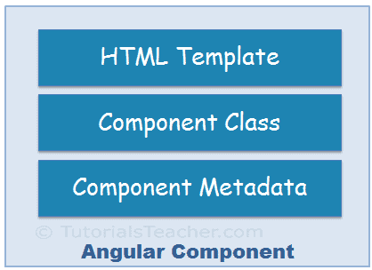

What Is an Angular Component?
==================


Angular Component = HTML Template + Component Class + Component Metadata

 
    <figcaption>&nbsp;&nbsp;&nbsp; Image - Angular Component </figcaption>

Every Angular application has at least one component that is used to display the data on the view. Technically, a
component is nothing but a simple typescript class and composed of three things as follows:

    1. Class (Typescript class)
    2. Template (HTML Template or Template URL)
    3. Component Metadata (@Component Decorator)

Template:
-------------------
The template is used to define an interface with which the user can interact. As part of that template, you can define
HTML Mark-up; you can also define the directives, and bindings, etc. So in simple words, we can say that the template
renders the view of the application with which the end-user can interact i.e. user interface.

Class:
-------------------
The Class is the most important part of a component in which we can write the code which is required for a template to
render in the browser. You can compare this class with any object-oriented programming language classes such as C++, C#
or Java. The angular component class can also contain methods, variables, and properties like other programming
languages. The angular class properties and variables contain the data which will be used by a template to render on the
view. Similarly, the method in an angular class is used to implement the business logic like the method does in other
programming languages.

Component Metadata:
-------------------
Metadata is some extra data for a component used by Angular API to execute the component, such as the location of HTML
and CSS files of the component, selector, providers, etc.

`Note:` Whenever we create any component, we need to define that component in `@NgModule`.

Components are like the basic building block in an Angular application. Components are defined using the `@component`
decorator. A component has a `selector`, `template`, `style` and other properties, using which it specifies the metadata
required to process the component.

From the official docs:

```
Components are the most basic building block of an UI in an Angular application. An Angular application is a tree of Angular components. 
Angular components are a subset of directives. Unlike directives, components always have a template and only one component can be instantiated per an element in a template.
```
