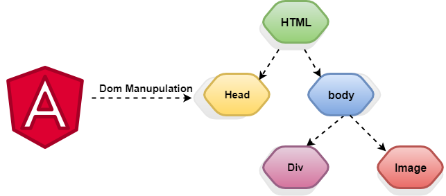
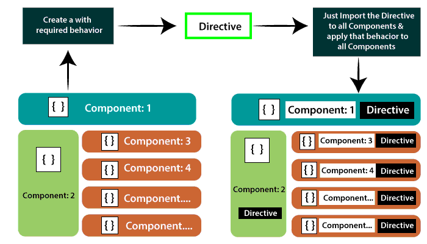

Angular Directive
==================


Directives are custom HTML attributes which tell angular to change the style or behavior of the Dom elements. When we
say that components are the building blocks of Angular applications, we are actually saying that directives are the
building blocks of Angular applications.

There are three kinds of directives:

1. Components Directives — directives with a template.
2. Structural Directives — change the DOM layout by adding and removing DOM elements.
3. Attribute Directives — change the appearance or behavior of an element, component, or another directive.


Directives are instructions in the DOM (Document Object Model). It specifies how to place our business logic in Angular.
The directive is markers on a DOM element that tell Angular to attach a specified behavior to that DOM element or even
transform the DOM element and its children. Mostly directives in Angular starts with ng- where ng stands for Angular,
and it extends the HTML.

 


Components Directives:
----------------

Components are the most common of the directives. It contains the details of how the component should be processed,
instantiated, and used at runtime. The component comprises meta-data.

Every component has Input and Output option to pass between component and its parent HTML elements.

```html

<component-selector-name [input-reference]="input-value"> ...</component-selector-name>
```

For example,

```html

<list-item [items]="fruits"> ...</list-item>
```

Here, list-item is a component and items is the input option. We will learn how to create component and advanced usages
in the later chapters.


Structural Directives:
----------------
Structural Directives are done in the elements section. These directives are used to manipulate and change the structure
of the DOM elements. Structural directives have a star (*) sign before the directive. Like as,* ngIf, *ngFor, and *
ngSwitch directive.

- `*ngIf Directive`: The `*ngIf` is used to create or remove a part of the DOM tree depending on a condition.
- `*ngSwitch Directive`: The `*ngSwitch` is like the JavaScript switch. It can display one element from among several
  possible elements, based on a switch condition. Angular puts only the selected element into the DOM.
- `*ngFor Directive`: The `*ngFor` directive is used to repeat a part of HTML template once per each item from an
  iterable list (Collection).

```html

<HTMLTag [structuralDirective]='value'/>
```

Example For NgIf:

```html

<div *ngIf="isNeeded">
  Only render if the *isNeeded* value has true value.
</div>

<div *ngIf=”movie”>{{movie.name}}</div>

<div template=”ngIf movie”>{{movie.name}}</div>

<ng-template [ngIf]=”movie”>
  <div>{{movie.name}}</div>
</ng-template>

```

Here, `ngIf` is a built-in directive used to add or remove the HTML element in the current HTML document.

Example For Ngfor:

```typescript
<div *ngFor="let movie of movies">{{movie.name}}</div>

```

```typescript
<div template="ngFor let movie of movies">{{movie.name}}</div>

```

```typescript
<ng-template ngFor let-movie [ngFor]="movies">{{movie.name}} </ng-template>
```

- The let keyword declares a template input variable that you reference within the template. The input variables in this
  example is movie. The parser translates let movie into variables named, let-movie.
- As the NgFor directive loops through the list, it sets and resets properties of its own context

Example For Ngswitch:

```typescript
<div> <ng-template [ngSwitch]="'sad'">

<horror-movie [movie]="movie"></horror-movie>

 </ng-template> </div>

```

The Angular `NgSwitch` is actually a set of cooperating directives: `NgSwitch`, `NgSwitchCase`, and `NgSwitchDefault`.
`NgSwitchCase` and `NgSwitchDefault` are structural directives. You attach them to elements using the asterisk `(*)`
prefix notation. A `NgSwitchCase` displays its host element when its value matches the switch value.
The `NgSwitchDefault` displays its host element when no sibling `NgSwitchCase` matches the switch value.


Attribute Directives:
----------------

It deals with changing the look and behavior of the DOM element. For example: `ngClass`, `ngStyle` etc.

- NgClass Directive: The `ngClass` Directive is used to add or remove CSS classes to an element.
- NgStyle Directive: The `ngStyle` Directive facilitates you to modify the style of an HTML element using the
  expression. We can also use the `ngStyle` Directive to change the style of our HTML element dynamically

 

```html

<HTMLTag [attrDirective]='value'/>
```

For example,

```html 
<p [showToolTip]='Tips' />
```

Here, `showToolTip` refers an example directive, which when used in a HTML element will show tips while user hovers the
HTML element.

We use attribute directives to apply conditional style to elements, show or hide elements or dynamically change the
behavior of a component according to a changing property.

Angular provides many built-in Attribute Directives like `NgStyle`, `NgClass`, etc. We can also create our own custom
Attribute Directives for our desired functionality.

`NgStyle` Directive is an Attribute directive used to change the styling of any DOM element on the basis of some
condition.

```typescript
<p [ngStyle] = "{'background': isBlue ? 'blue' : 'red'}" > I am an Attribute Directive < /p>
```

In this code snippet, we are adding a blue background if the value of isBlue variable is true. If the value of `isBlue`
variable is false, then the background of the above element will be red.


Difference between Structural Directive and Attribute Directive
----------------

|  Structural Directive       |  Attribute Directive  |
| ----------- | ----------- |
| Structural directives are applied to `<template>` elements and used to add or remove content (stamp and template).      | The component has their view (HTML and styles) because of that, there can be one component on a host element, but multiple directives.       |

How to Create Custom Directives?
----------------

We can create our custom directives to use in Angular components with the help of the command line. The command which is
used to develop the Directive using the command line is as follows-

```typescript
ng g directive name of the Directive
```

For example,

```typescript
ng g directive change text
```

It is seen in the command line as given in the below code-
```typescript
C:\ang-app>ng g directive change text
CREATE src/app/change-text.directive.spec.ts (241 bytes)
CREATE src /app/change-text.directive.ts (149 bytes)
UPDATE src/app/app.module.ts (565 bytes)
```

The above files, i.e., `change-text directive.spec.ts` and `change-text.directive.ts` created and the `app.module.ts` is updated.

app.module.ts:;

```typescript
import { BrowserModule } from ‘@angular/platform-browser’;
import { NgModule } from ‘@angular/core’;
import { AppRoutingModule } from ‘./app-routing.module’;
import { AppComponent } from ‘./app.component’;
import { NewcmpComponent } from ‘. /new-cmp.component’;
import { ChangeTextDirective } from ‘. /change-text.directive’;
@NgModule({
declarations: [
AppComponent,
NewCmpComponent,
ChangeTextDirective
],
Imports: [
BrowserModule,
AppRoutingModule
],
providers: [ ],
bootstrap: [AppComponent]
}]
export class AppModule { }  
```
The `ChangeTextDirective` class has been included in the declarations in the above file. The class is also imported from the file given below-

Change-text.directive
```typescript
Import {Directive}  from ‘@angular/core’;
@Directive ({
Selector; ‘[changeText]’
})
Export class ChangeTextDirective {
Constructor ( ) { }
}
```
The above file has a directive and it also has a selector property. Whatever we define in the selector, the same has to match in the view, where we assign the custom directive.

In the `app.component.html` view, add the directive as follows-
```html
<!—The content below is only a placeholder and replaced.-->
<div style= "text-align:center">
<h1>Welcome to {{title}}. </h1>
</div>
<div style = "text-align:center">
<span changeText > Welcome to {{ title}}.</span>
</div> 
```
We will write the changes in `change-text.directive.ts` file as-

change-text.directive.ts
```typescript
import { Directive, elementRef} from
‘@angular/core’;
@Directive({
Selector: ‘[changeText]’’
})
Export class ChangeTextDirective {
Constructor(Element: ElementRef) {
Console.log(Element);
Element.nativeElement.innerText= “Text is changed by changeText Directive.”;
}
}
```
In the above file, there is a class known as `ChangeTextDirective`, and also a constructor.


For more information:

1. [Angular 8 Directives](https://www.tutorialandexample.com/angular-8-directives/)
2. [Angular 8 - Directives](https://www.tutorialspoint.com/angular8/angular8_directives.htm)
3. [Concepts Of Angular Directives](https://medium.com/@venkateshece1105/concepts-of-angular-directives-527ae0ca5995)
4. [A Practical Guide to Angular Directives](https://www.sitepoint.com/practical-guide-angular-directives/)
