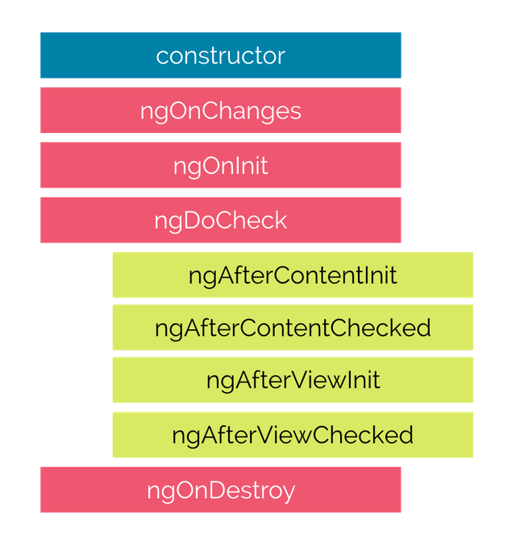

# Angular Lifecycle Hooks

Angular creates and renders components along with their children, checks when their data-bound properties change, and destroys them before removing them from the DOM.

Angular offers lifecycle hooks that provide visibility into these key life moments and the ability to act when they occur.

Angular 2 application goes through an entire set of processes or has a lifecycle right from its initiation to the end of the application.

The hooks are executed in this order:

 

Description of each lifecycle hook.

- **ngOnChanges** − When the value of a data bound property changes, then this method is called.
- **ngOnInit** − This is called whenever the initialization of the directive/component after Angular first displays the data-bound properties happens.
- **ngDoCheck** − This is for the detection and to act on changes that Angular can't or won't detect on its own.
- **ngAfterContentInit** − This is called in response after Angular projects external content into the component's view.
- **ngAfterContentChecked**− This is called in response after Angular checks the content projected into the component.
- **ngAfterViewInit** − This is called in response after Angular initializes the component's views and child views.
- **ngAfterViewChecked** − This is called in response after Angular checks the component's views and child views.
- **ngOnDestroy** − This is the cleanup phase just before Angular destroys the directive/component.

constructor() vs ngOnInit()
---------

TypeScript classes has a default method called `constructor()` which is normally used for the initialization purpose. Whereas `ngOnInit()` method is specific to Angular, especially used to define Angular bindings. Even though `constructor()` getting called first, it is preferred to use `ngOnInit()` method for Angular bindings.

Example

```typescript
export class App implements OnInit{
    constructor(){
        //called first time before the ngOnInit()
    }

    ngOnInit(){
        //called after the constructor and called  after the first ngOnChanges()
    }
}
```

For more information:
1. [Angular Lifecycle Hooks: ngOnChanges, ngOnInit, and more](https://www.freecodecamp.org/news/angular-lifecycle-hooks/)
2. [Angular 2 - Lifecycle Hooks](https://www.tutorialspoint.com/angular2/angular2_lifecycle_hooks.htm)
3. [Angular lifecycle hooks explained](https://blog.logrocket.com/angular-lifecycle-hooks/)


