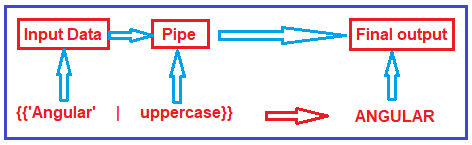
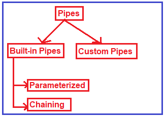

Angular Pipes
==================

Angular Pipes are used to transform data on a template, without writing a boilerplate code in a component.

A pipe takes in data as input and transforms it to the desired output. It is like a filter in Angular 1 (AngularJS).

Generally, If we need to transform data, we write the code in the component, For example, we want to transform today’s date into a format like `'16 Apr 2018'` or `'16-04-2018'`
,We need to write separate code in the component.

So instead of writing separate boilerplate code, we can use the built-in pipe called `DatePipe` which will take input and transform it into the desired date format.

Syntax to use Pipes in Angular Application:

Types of Pipes in Angular:
The Angular Framework divided the Pipes into two types i.e. 
1. Built-in Pipes and 
2. Custom Pipes. 
   
Further Built-in Pipes are divided into two types i.e. Parameterized and chaining as shown in the below image.

Angular provides built-in pipes for typical data transformations, including transformations for internationalization (i18n), which use locale information to format data. The following are commonly used built-in pipes for data formatting:

[DatePipe](https://angular.io/api/common/DatePipe): Formats a date value according to locale rules.
[UpperCasePipe](https://angular.io/api/common/UpperCasePipe): Transforms text to all upper case.
[LowerCasePipe](https://angular.io/api/common/LowerCasePipe): Transforms text to all lower case.
[CurrencyPipe](https://angular.io/api/common/CurrencyPipe): Transforms a number to a currency string, formatted according to locale rules.
[DecimalPipe](https://angular.io/api/common/DecimalPipe): Transforms a number into a string with a decimal point, formatted according to locale rules.
[PercentPipe](https://angular.io/api/common/PercentPipe): Transforms a number to a percentage string, formatted according to locale rules.

For more information:
1. [Transforming Data Using Pipes](https://angular.io/guide/pipes)
2. [Angular Pipes](https://dotnettutorials.net/lesson/angular-pipes/)

