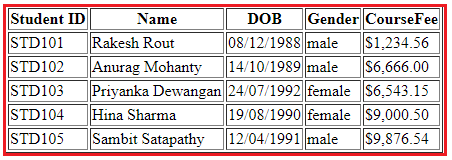

Angular Pipes
==================

Angular Pipes are used to transform data on a template, without writing a boilerplate code in a component.

A pipe takes in data as input and transforms it to the desired output. It is like a filter in Angular 1 (AngularJS).

Generally, If we need to transform data, we write the code in the component, For example, we want to transform today’s date into a format like `'16 Apr 2018'` or `'16-04-2018'`
,We need to write separate code in the component.

So instead of writing separate boilerplate code, we can use the built-in pipe called `DatePipe` which will take input and transform it into the desired date format.

Syntax to use Pipes in Angular Application:
---------------


A pipe takes in data as input and transforms it to a desired output. For example, let us take a pipe to transform a component birthday property into a human-friendly date using **date** pipe.
```typescript
import { Component } from '@angular/core';

@Component({
  selector: 'app-birthday',
  template: `<p>Birthday is {{ birthday | date }}</p>`
})
export class BirthdayComponent {
  birthday = new Date(2002, 6, 18); // June 18, 2002
}
```

## Types of Pipes in Angular: 

The Angular Framework divided the Pipes into two types i.e. 
1. Built-in Pipes and 
2. Custom Pipes. 
   
Further Built-in Pipes are divided into two types i.e. Parameterized and chaining as shown in the below image.


### 1. Built-in Pipes 

Angular provides built-in pipes for typical data transformations, including transformations for internationalization (i18n), which use locale information to format data. The following are commonly used built-in pipes for data formatting:


[DatePipe](https://angular.io/api/common/DatePipe): Formats a date value according to locale rules.

[UpperCasePipe](https://angular.io/api/common/UpperCasePipe): Transforms text to all upper case.

[LowerCasePipe](https://angular.io/api/common/LowerCasePipe): Transforms text to all lower case.

[CurrencyPipe](https://angular.io/api/common/CurrencyPipe): Transforms a number to a currency string, formatted according to locale rules.

[DecimalPipe](https://angular.io/api/common/DecimalPipe): Transforms a number into a string with a decimal point, formatted according to locale rules.

[PercentPipe](https://angular.io/api/common/PercentPipe): Transforms a number to a percentage string, formatted according to locale rules.

For example,
```html
<table border="1">
    <thead>
        <tr>
            <th>Student ID</th>
            <th>Name</th>
            <th>DOB</th>
            <th>Gender</th>
            <th>CourseFee</th>            
        </tr>
    </thead>
    <tbody>
        <tr *ngFor='let student of students'>
            <td>{{student.ID | uppercase}}</td>
            <td>{{student.Name | titlecase}}</td>
            <td>{{student.DOB | date:'dd/MM/yyyy'}}</td>
            <td>{{student.Gender | lowercase}}</td>
            <td>{{student.CourseFee | currency:'USD':true}}</td>
        </tr>
    </tbody>
</table>
```

Output:



### 2.Custom Pipes 

To create a custom pipe, create a new ts file and use the code according to the work you have to do. You have to import Pipe, PipeTransform from Angular/Core. Let's create a sqrt custom pipe.


component.ts file:
```typescript
import {Pipe, PipeTransform} from '@angular/core';  
@Pipe ({  
name : 'sqrt'  
})  
export class SqrtPipe implements PipeTransform {  
transform(val : number) : number {  
return Math.sqrt(val);  
}  
}
```
Now, it's turn to make changes in the app.module.ts. Create a class named as SqrtPipe. This class will implement the PipeTransform. The transform method defined in the class will take argument as the number and will return the number after taking the square root.

As, we have created a new file so, we need to add the same in app.module.ts.

Module.ts file:
```typescript
import { BrowserModule } from '@angular/platform-browser';  
import { NgModule } from '@angular/core';  
import { AppComponent } from './app.component';  
import { NewCmpComponent } from './new-cmp/new-cmp.component';  
import { ChangeTextDirective } from './change-text.directive';  
import { SqrtPipe } from './app.sqrt';  
@NgModule({  
declarations: [  
SqrtPipe,  
AppComponent,  
NewCmpComponent,  
ChangeTextDirective  
],  
imports: [  
BrowserModule  
],  
providers: [],  
bootstrap: [AppComponent]  
})  
export class AppModule { }
```
Now, use sqrt pipe in component.html file.

component.html file:
```html
<h1>Example of Custom Pipe</h1>  
<h2>Square root of 625 is: {{625 | sqrt}}</h2><br/>  
<h2>Square root of 169 is: {{169 | sqrt}}</h2>  
```
Output:
```html
Example of Custom Pipe

Square root of 625 is: {{625 | sqrt}}

Square root of 169 is: {{169 | sqrt}}

```

Parameterized Pipe
-----------------

A pipe can accept any number of optional parameters to fine-tune its output. The parameterized pipe can be created by declaring the pipe name with a colon (` : `) and then the parameter value. If the pipe accepts multiple parameters, separate the values with colons. Lets take a birthday example with a particular format(dd/mm/yyyy)

```typescript
import { Component } from '@angular/core';

@Component({
  selector: 'app-birthday',
  template: `<p>Birthday is {{ birthday | date:'dd/mm/yyyy'}}</p>` // 18/06/2002
})
export class BirthdayComponent {
  birthday = new Date(2002, 6, 18);
}
```

*Note: The parameter value can be any valid template expression, such as a string literal or a component property.*

Custom Pipe
-----------------

A pipe is a class decorated with pipe metadata `@Pipe()` decorator, which you import from the core Angular library

```typescript
@Pipe({name: 'myCustomPipe'})
```
The pipe class implements the **PipeTransform()** interface transform method that accepts an input value followed by optional parameters and returns the transformed value.

```typescript
interface PipeTransform {
  transform(value: any, ...args: any[]): any
}
```
The `@Pipe()` decorator allows to define the pipe name that you'll use within template expressions. It must be a valid JavaScript identifier.
```typescript
template: `{{someInputValue | myCustomPipe: someOtherValue}}`
```
Example:
```typescript
import { Pipe, PipeTransform } from '@angular/core';

@Pipe({name: 'customFileSizePipe'})
export class FileSizePipe implements PipeTransform {
  transform(size: number, extension: string = 'MB'): string {
    return (size / (1024 * 1024)).toFixed(2) + extension;
  }
}
```
Now you can use the above pipe in template expression as below,
```typescript
  template: `
    <h2>Find the size of a file</h2>
    <p>Size: {{288966 | customFileSizePipe: 'GB'}}</p>
  `
```

Pure vs Impure Pipe
------------------


A pure pipe is only called when Angular detects a change in the value or the parameters passed to a pipe. For example, any changes to a primitive input value (String, Number, Boolean, Symbol) or a changed object reference (Date, Array, Function, Object). An impure pipe is called for every change detection cycle no matter whether the value or parameters changes. i.e, An impure pipe is called often, as often as every keystroke or mouse-move.

**impure-pipe** works for every change in the component  
**pure-pipe** works only when the component is loaded.

```typescript
@Pipe({
  name: 'sort',
  pure: false // true makes it pure and false makes it impure
})
export class myPipe implements PipeTransform {

  transform(value: any, args?: any): any {
     // your logic here and return the result
  }
}
```

```html
<div> {{ arrayOfElements | sort }}<div>
```


For more information:
1. [Transforming Data Using Pipes](https://angular.io/guide/pipes)
2. [Angular Pipes](https://dotnettutorials.net/lesson/angular-pipes/)
3. [Angular 7 Pipes](https://www.javatpoint.com/angular-7-pipes)


