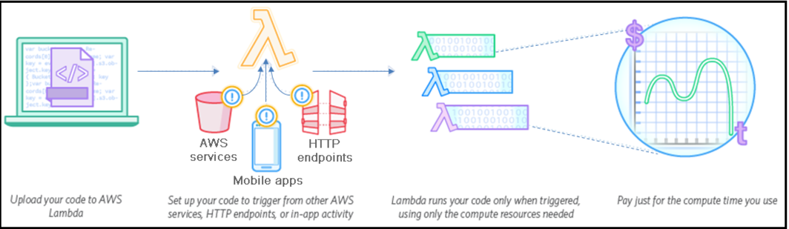

# AWS Lambda

#  Introducing AWS Lambda

Lambda is a simple compute service that runs your code in response to certain events.
These events can be anything, from an upload operation of an object to an S3 bucket, a
record insertion in a DynamoDB table, or even some form of event triggered from your
mobile app. The idea here is simple--you simply provide your code to AWS Lambda.
Lambda will internally take care of provisioning and managing the underlying
infrastructure resources, making sure your code gets deployed successfully; even things like
your code's scalability and high availability are taken care of by Lambda itself!

# Key benefits of serverless computing

##  No ware to manage: 

Perhaps one of the biggest reasons for the hype about
serverless computing is the fact there is absolutely no hardware or software to
manage. The management of the serverless computing environment all the way
from the underlying hardware to the OS, to even the application's platform layer,
is managed by the cloud provider itself.

##  Faster execution time: 
Unlike your standard cloud instances, which generally
take a good minute or two to boot up, functions, on the other hand, spin up very
quickly, mostly in a matter of seconds. This could be due to the fact that the
functions are made to run on top of a containerized platform.

##  Really low costs: 
Since there is virtually no opex involved with serverless
computing, it is fairly cheap, even when compared to hosting and managing
instances in the cloud. Also, the pricing model for serverless computing is a little
different from that of your traditional cloud pricing model. Here, you are
generally billed on the duration of your function's execution and the amount of
memory it consumed during its execution period. The duration is calculated from
the time your code begins executing until it returns or otherwise terminates and
is rounded up to the nearest 100 ms.

##  Support of popular programming languages: 
Most cloud providers that provide
serverless computing frameworks today, support a variety of programming
languages, such as Java, Node.js, Python, and even C#. Azure functions allows
the use of F#, PHP, Bash, Batch and PowerShell scripts in addition to the few
mentioned.

##  Microservices compatible: 
Since serverless computing functions are small,
independent chunks of code that are designed to perform a very specific set of
roles or activities, they can be used as a delivery medium for microservices as
well. This comes as a huge advantage as compared to hosting your monolithic
applications on the cloud, which do not scale that effectively.

##  Event-driven applications: 
Serverless functions are an ideal choice for designing
and running event-driven applications that react to certain events and take some
action against them. For example, an image upload operation to a cloud storage
triggers a function that creates associated thumbnail images for the same.

There are a few cons to serverless computing as well that you should be aware of before we proceed further:

# Cons or Disadvantage  of serverless computing

##  Execution duration: 
Serverless functions are designed to run for short durations
of time, ideally somewhere under 300 seconds only. This is a hard limit set by
most cloud providers, however, there are a few workarounds to this as well.
Stateless: Serverless functions are purely stateless, which means that once the
function completes its execution or is terminated for some reason, it won't store
any data locally on its disk.

##  Complexity: 
The smaller you make things, the more complex it's going to
become. Although writing functions that perform very particular tasks is a good
idea, it can cause complexity issues when you view your application as a whole
system. A simple example can break one large application into some ten different
functions such that each perform a specific task. Now you need to manage ten
different entities rather than just one. Imagine if you had a thousand functions
instead.

##  Lack of tools: 
Although serverless computing is all at its hype, it still doesn't
provide a lot of out-of-the-box tools for management, deployment, and even
monitoring. Most of your monitoring tools that you use today were designed for
long-running, complex applications; not for simple functions that execute in a
mere seconds.

##  Vendor lock-in: 
With each cloud provider providing its own unique tool sets and
services around serverless computing, you often tend to get tied down to a
particular vendor. This means that you cannot change your cloud provider
without making some changes to your functions as well.

 

Reference : https://aws.amazon.com/lambda/

