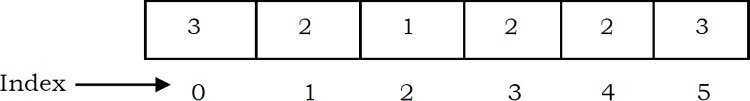
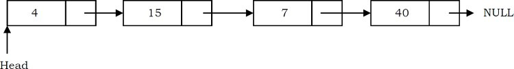

# Data Types

There are two types of data types:
• System-defined data types (also called Primitive data types)
• User-defined data types

## System-defined data types (Primitive data types)

Data types that are defined by system are called primitive data types. The primitive data types provided by many programming languages are: int, float, char, double, bool, etc. The number of bits allocated for each primitive data type depends on the programming languages, the compiler and the operating system. For the same primitive data type, different languages may use different sizes. Depending on the size of the data types, the total available values (domain) will also change.

For example, “int” may take 2 bytes or 4 bytes. If it takes 2 bytes (16 bits), then the total possible values are minus 32,768 to plus 32,767 (-215 to 215-1). If it takes 4 bytes (32 bits), then the possible values are between -2,147,483,648 and +2,147,483,647 (-231 to 231-1). The same is the case with other data types.

## User defined data types

If the system-defined data types are not enough, then most programming languages allow the users to define their own data types, called user – defined data types. Good examples of user defined data types are: structures in C/C + + and classes in Java

# Data Structures

A data structure is a special format for organizing and storing data. General data structure types include arrays, files, linked lists, stacks, queues, trees, graphs and so on.

Depending on the organization of the elements, data structures are classified into two types:

## Linear data structures:

Elements are accessed in a sequential order but it is not compulsory to store all elements sequentially. Examples: Linked Lists, Stacks and Queues.

## Non – linear data structures:

Elements of this data structure are stored/accessed in a non-linear order. Examples: Trees and graphs.

# Commonly Used Rates of Growth

The diagram below shows the relationship between different rates of growth.

Below is the list of growth rates.

# Arrays

One memory block is allocated for the entire array to hold the elements of the array. The array elements can be accessed in constant time by using the index of the particular element as the subscript.

To access an array element, the address of an element is computed as an offset from the base address of the array and one multiplication is needed to compute what is supposed to be added to the base address to get the memory address of the element. First the size of an element of that data type is calculated and then it is multiplied with the index of the element to get the value to be added to the base address.

This process takes one multiplication and one addition. Since these two operations take constant time, we can say the array access can be performed in constant time.

## Advantages of Arrays
- Simple and easy to use
- Faster access to the elements (constant access)

## Disadvantages of Arrays

Preallocates all needed memory up front and wastes memory space for indices in the array that are empty.
- Fixed size: The size of the array is static (specify the array size before using it).
- One block allocation: To allocate the array itself at the beginning, sometimes it may not be possible to get the memory for the complete array (if the array size is big).
- Complex position-based insertion: To insert an element at a given position, we may need to shift the existing elements. This will create a position for us to insert the new element at the desired position. If the position at which we want to add an element is at the beginning, then the shifting operation is more expensive.

## Dynamic Arrays

Dynamic array (also called as growable array, resizable array, dynamic table, or array list) is a random access, variable-size list data structure that allows elements to be added or removed.

One simple way of implementing dynamic arrays is to initially start with some fixed size array. As soon as that array becomes full, create the new array double the size of the original array.

Similarly, reduce the array size to half if the elements in the array are less than half.

Note: We will see the implementation for dynamic arrays in the Stacks, Queues and Hashing chapters.

# Linked List

A linked list is a data structure used for storing collections of data. A linked list has the following properties.
- Successive elements are connected by pointers
- The last element points to NULL
- Can grow or shrink in size during execution of a program
- Can be made just as long as required (until systems memory exhausts)
- Does not waste memory space (but takes some extra memory for pointers). It allocates memory as list grows.

  

## Advantages of Linked Lists

The advantage of linked lists is that they can be expanded in constant time. To create an array, we must allocate memory for a certain number of elements. To add more elements to the array when full, we must create a new array and copy the old array into the new array. This can take a lot of time.

We can prevent this by allocating lots of space initially but then we might allocate more than we need and waste memory. With a linked list, we can start with space for just one allocated element and add on new elements easily without the need to do any copying and reallocating.

## Disadvantages of Linked Lists

There are a number of issues with linked lists. The main disadvantage of linked lists is access time to individual elements. Array is random-access, which means it takes O(1) to access any element in the array. Linked lists take O(n) for access to an element in the list in the worst case. Another advantage of arrays in access time is spacial locality in memory. Arrays are defined as contiguous blocks of memory, and so any array element will be physically near its neighbors. This greatly benefits from modern CPU caching methods.

Although the dynamic allocation of storage is a great advantage, the overhead with storing and retrieving data can make a big difference. Sometimes linked lists are hard to manipulate. If the last item is deleted, the last but one must then have its pointer changed to hold a NULL reference. This requires that the list is traversed to find the last but one link, and its pointer set to a NULL reference.

Finally, linked lists waste memory in terms of extra reference points.

## Comparison of Linked Lists with Arrays & Dynamic Arrays

  

