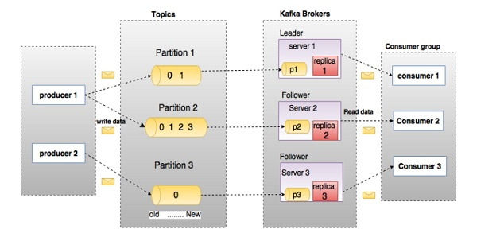

Kafka
=================

> Apache Kafka is a publish-subscribe messaging system developed by Apache written in Scala. It is a distributed, partitioned and replicated log service.

The important features are data partitioning, scalability, low-latency, high throughputs, stream processing, durability, zero data loss, etc. 

The main components of Kafka are:

- **Topic**: A bunch of messages which are of the same type come under the same topic.
- **Producer**: A producer, as the name suggests, produces messages and can communicate to the selected topic.
- **Brokers**: These act as a channel between the producers and consumers. They are a set of servers where the published messages are stored.
- **Consumer**: The consumer is the one who is going to the consumer the published data. It can subscribe to different topics and then pull data from the brokers.

Advantages of Kafka
-------------------
There are some advantages of Kafka, which makes it significant to use:

- **High-throughput** : We do not need any large hardware in Kafka, because it is capable of handling high-velocity and high-volume data. Moreover, it can also support message throughput of thousands of messages per second.
- **Low Latency** : Kafka can easily handle these messages with the very low latency of the range of milliseconds, demanded by most of the new use cases.
- **Fault-Tolerant** : Kafka is resistant to node/machine failure within a cluster.
- **Durability** : As Kafka supports messages replication, so, messages are never lost. It is one of the reasons behind durability.
- **Scalability** : Kafka can be scaled-out, without incurring any downtime on the fly by adding additional nodes.

The primary advantages of Kafka include fault-tolerance, higher throughput, scalability, lower latency, and durability. Kafka does not require any large-scale hardware components and shows exceptional performance in the management of high-volume and high-velocity data.

Most important of all, it can support message throughput at the rate of thousand messages per second. Kafka depicts promising resistance to the failure of nodes or machines within a cluster. Lower latency of Kafka can help in easily managing the messages within milliseconds. In addition, Kafka also ensures message replication, thereby reducing any concerns of message loss. Another critical benefit of Apache Kafka is the scalability that it ensures through the addition of more nodes.

Offset in Kafka
---------------

- There is a sequential ID number given to the messages in the partitions what we call, an offset. So, to identify each message in the partition uniquely, we use these offsets.
- Offset is nothing but a unique id that is assigned to the partitions. The messages are contained in this partitions. The important aspect or use of offset is that it identifies every message with the id which is available within the partition.

Consumer group in Kafka
-----------------------

A Consumer group is made up of one or more consumers that together subscribe to the different topics and fetch data from the brokers.

ZooKeeper in Kafka
---------------

Apache Kafka is a distributed system is built to use Zookeeper. Although, Zookeeper’s main role here is to build coordination between different nodes in a cluster. However, we also use Zookeeper to recover from previously committed offset if any node fails because it works as periodically commit offset.

In addition, Zookeeper also helps in leader detection, configuration management, synchronization, and detecting any node leaving or joining the cluster. Furthermore, Kafka implements Zookeeper as storage for offsets of consumed messages regarding a specific topic. Zookeeper also helps in partitioning the offsets of messages according to specific Consumer Groups.

Can I use Kafka without Zookeeper?
-----------------------

No. You cannot bypass Zookeeper for a direct connection with the Kafka server. In addition, it is also essential to note that servicing client requests becomes impossible when Zookeeper is experiencing downtime.

It is impossible to bypass Zookeeper and connect directly to the Kafka server, so the answer is no. If somehow, ZooKeeper is down, then it is impossible to service any client request.

What is Zookeeper in Kafka? Can we use Kafka without Zookeeper?
-----------------------
Zookeeper is an open source, high-performance co-ordination service used for distributed applications adapted by Kafka.

No, it is not possible to bye-pass Zookeeper and connect straight to the Kafka broker. Once the Zookeeper is down, it cannot serve client request.

- Zookeeper is basically used to communicate between different nodes in a cluster
- In Kafka, it is used to commit offset, so if node fails in any case it can be retrieved from the previously committed offset
- Apart from this it also does other activities like leader detection, distributed synchronization, configuration management, identifies when a new node leaves or joins, the cluster, node status in real time, etc.

Partition in Kafka
---------------
In every Kafka broker, there are few partitions available. And, here each partition in Kafka can be either a leader or a replica of a topic

- Topic partition is the unit of parallelism in Kafka. On both the producer and the broker side, writes to different partitions can be done fully in parallel. On the consumer side, Kafka always gives a single partition’s data to one consumer thread. Thus, the degree of parallelism in the consumer (within a consumer group) is bounded by the number of partitions being consumed. Therefore, in general, the more partitions there are in a Kafka cluster, the higher the throughput one can achieve.

- How many partitions are there inside each Topic? That's configurable. 
    You can increase partition but once increased, you can not decrease it. Apache Kafka provides us with alter command to change Topic behavior and add/modify configurations. We will be using alter command to add more partitions to an existing Topic.

Here is the command to increase the partitions count for topic 'my-topic' to 20 -

> ./bin/kafka-topics.sh --alter --zookeeper localhost:2181 --topic my-topic --partitions 20

You can verify whether partitions have been increased by using describe command as follows -

> ./bin/kafka-topics.sh --describe --zookeeper localhost:2181 --topic my-topic

APIs of Kafka
---------------
Apache Kafka has 4 main APIs:

1. Producer API
2. Consumer API
3. Streams API
4. Connector API

Load balancing of the server in Kafka
---------------
In every partition of Kafka, there is one server which acts as the Leader, and none or more servers plays the role as a Followers.

As the main role of the Leader is to perform the task of all read and write requests for the partition, whereas Followers passively replicate the leader. Hence, at the time of Leader failing, one of the Followers takeover the role of the Leader. Basically, this entire process ensures load balancing of the servers.

Retention period in Kafka cluster
---------------

However, retention period retains all the published records within the Kafka cluster. It doesn’t check whether they have been consumed or not. Moreover, the records can be discarded by using a configuration setting for the retention period. And, it results as it can free up some space.

The maximum size of a message that can be received by the Kafka is approx. 10,00,000 bytes.

RabbitMQ vs Apache Kafka
---------------

- **Features**
    - Apache Kafka– Kafka is distributed, durable and highly available, here the data is shared as well as replicated.
    - RabbitMQ– There are no such features in RabbitMQ.
  
- **Performance rate**
    - Apache Kafka– To the tune of 100,000 messages/second.
    - RabbitMQ- In case of RabbitMQ, the performance rate is around 20,000 messages/second.

Explain Apache Kafka Use Cases?
---------------
Apache Kafka has so many use cases, such as:

- **Kafka Metrics** It is possible to use Kafka for operational monitoring data. Also, to produce centralized feeds of operational data, it involves aggregating statistics from distributed applications.
- **Kafka Log Aggregation** Moreover, to gather logs from multiple services across an organization.
- **Stream Processing** While stream processing, Kafka’s strong durability is very useful.

Kafka Cluster, and its key benefits
---------------
Kafka cluster is a group containing more than one broker. It has zero downtime during the expansion of clusters and can help in the replication of message data and management of persistence.

The cluster-centric design of the Kafka cluster improves durability. Most important of all, one of the brokers in a cluster manages the states of replicas and partitions. The concerned broker is also responsible for performing administrative tasks such as the reassignment of partitions.

Replicas in Kafka
---------------
Replicas in Kafka are basically a list of nodes that replicate the log for a specific partition without considering whether the nodes serve as the Leader. Replicas are highly significant in Kafka because of the safety of published messages. Replication ensures that users can consume published messages even in circumstances such as program error, regular software updates, or machine errors.

Starting a Kafka server
---------------
Since Kafka uses ZooKeeper, it is essential to initialize the ZooKeeper server, and then fire up the Kafka server.

1. To start the ZooKeeper server: 
> bin/zookeeper-server-start.sh config/zookeeper.properties
2. Next, to start the Kafka server: 
> bin/kafka-server-start.sh config/server.properties

In the Producer, when does QueueFullException occur?
---------------
QueueFullException typically occurs when the Producer attempts to send messages at a pace that the Broker cannot handle. Since the Producer doesn’t block, users will need to add enough brokers to collaboratively handle the increased load.

Confluent Kafka vs. Apache Kafka
---------------

- **Performance**
    - Confluent Kafka performs really well, and even under the higher workloads, its performance is unwavering.
    - On the other hand, though Apache Kafka performs well, it still lags behind Confluent Kafka’s performance.
    
- **Pros and Cons**

    - **Confluent Kafka Pros**
        - It has almost all the attributes of Kafka and some extra attributes as well.
        - It streamlines the admin operations procedures with much ease.
        - It takes the burden of worrying about data relaying, off the data managers.
    - **Confluent Kaka Cons**
        - Confluent Kafka is created by using Apache Kafka, and hence the scope of tweaking it further is limited.
        - Confluent Kafka’s fault-tolerant capabilities may be questioned in some cases.

    - **Apache Kafka Pros**
        - Apache Kafka is an open-source platform.
        - It allows you to have the flexibility and features to tweak the code as per your requirements.
        - It is known for its fault tolerance and durability.
        - It is easily accessible and gives you real-time feedback.
    - **Apache Kafka Cons**
        - It is only a pub-sub platform and doesn’t have the entire data processing and data operations tools.
        - In some cases, if the workload goes too high, it tends to work an awry manner.
        - You cannot use the point-to-point and request/reply messages in Apache Kafka.
    
- **Pricing**
    - The pricing model of Confluent Kafka is based on cloud usage, and typically it costs you around $0.11 per GB. The usage calculated based on the data stored on the Confluent Cloud.
    - Apache Kafka is an open-source platform that you can use for free, but you need to store the data on your cloud/on-premise platforms.

Confluent Kafka has far more capabilities than Apache Kafka, but you need to pay to use Confluent Kafka.
But, Apache Kafka is free of cost, and you can make the tweaks as per your requirements on the platforms too.

For more information:
1. [Top 30 Apache Kafka Interview Questions](https://www.whizlabs.com/blog/apache-kafka-interview-questions/)
2. [Apache Kafka Tutorial](https://www.javatpoint.com/apache-kafka)

