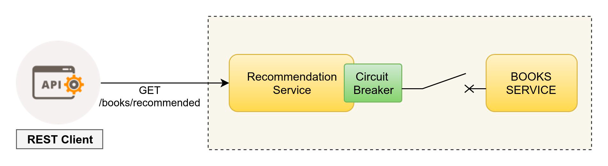

API Gateway
===========

API Gateway is a special class of microservices that meets the need of a single client application (such as android app, web app, angular JS app, iPhone app, etc) and provide it with single entry point to the backend resources (microservices), providing cross cutting concerns to them such as security, monitoring/metrics & resiliency

 

Client Application can access tens or hundreds of microservices concurrently with each request , aggregating the response and transforming them to meet the client application’s needs. Api Gateway can use a client side load balancer library (Ribbon) to distribute load across instances based on round-robin fashion. It can also do protocol translation i.e. HTTP to AMQP if necessary. It can handle security for the protected resources as well.

1. Spring Cloud DiscoveryClient integration
2. Declare intelligent routing for services, like:

```yaml
info.component: API Gateway
zuul.routes:
  customer-service:
    path: /customer/**
    serviceId: customer-service
  product-service:
    path: /product/**
    serviceId: product-service
```
customer-service is the application name of customer microservice, and fetched from eureka service registry using DiscoveryClient.

3. Request Rate Limiting (available in Spring Boot 2.x)
4. Path Rewriting
5. Hystrix Circuit Breaker integration for resiliency

How to retry failed requests at some other available instance using Client Side Load Balancer?
----

Spring Cloud Netflix provides two main mechanisms for making a HTTP requests using load balanced client (Ribbon) - RestTemplate and Feign. There is always a chance that a network call may fail due to any reason, and we may want to retry that request automatically on the next available server.

To enable this feature in Spring Cloud Netflix, we just need to include Spring Retry library on the classpath. When Spring Retry is present, the load balanced RestTemplate, Feign and Zuul will automatically retry any failed requests.


build.gradle.
compile('org.springframework.retry:spring-retry')

We can customize the retry behavior by configuring certain Ribbon properties, /src/main/resources/application.yml.
```properties
client.ribbon.MaxAutoRetries: 3
client.ribbon.MaxAutoRetriesNextServer: 1
client.ribbon.OkToRetryOnAllOperations: true
```

In case of Zuul Reverse Proxy, we can turn off retry functionality by setting /src/main/resources/application.yml.
```properties
zuul.retryable: false
```

Retry functionality can be disabled per route basis as well, /src/main/resources/application.yml.
```yaml
zuul:
  routes:
    <routename>.retryable: false
```

Circuit Breaker Pattern
-------

Microservices often need to make remote network calls to another microservices running in a different process. Network calls can fail due to many reasons, including-
1. Brittle nature of network itself
2. Remote process is hung or
3. Too much traffic on the target microservices than it can handle

This can lead to cascading failures in the calling service due to threads being blocked in the hung remote calls. Circuit breaker is a piece of software that is used to solve this problem. The basic idea is very simple - wrap a potentially failing remote call in a circuit breaker object that will monitor for failures/timeouts. Once the failures reach a certain threshold, the circuit breaker trips, and all further calls to the circuit breaker return with an error, without the protected call being made at all. This mechanism can protect the cascading effects of a single component failure in the system and provide a option to gracefully downgrade the functionality. 

A typical use of circuit breaker in microservices architecture looks like the following diagram-

 

Here a REST client calls the Recommendation Service which further communicates with Books Service using a circuit breaker call wrapper. As soon as the books-service API calls starts to fail, circuit breaker will trip (open) the circuit and will not make any further call to book-service until the circuit is closed again.


Open, Closed and Half-Open states of Circuit Breaker
----------

Circuit Breaker wraps the original remote calls inside it and if any of these calls fails, the failure is counted. When the service dependency is healthy and no issues are detected, the circuit breaker is in Closed State. All invocations are passed through to the remote service. 

If the failure count exceeds a specified threshold within a specified time period, the circuit trips into the Open State. In the Open State, calls always fail immediately without even invoking the actual remote call. The following factors are considered for tripping the circuit to Open State -
- An Exception thrown (HTTP 500 error, can not connect)
- Call takes longer than the configured timeout (default 1 second)
- The internal thread pool (or semaphore depending on configuration) used by hystrix for the command execution rejects the execution due to exhausted resource pool.

After a predetermined period of time (by default 5 seconds), the circuit transitions into a half-open state. In this state, calls are again attempted to the remote dependency. Thereafter the successful calls transitions the circuit breaker back into the closed state, while the failed calls return the circuit breaker into the open state.


Use-cases for Circuit Breaker Pattern
----------

1. Synchronous communication over the network that is likely to fail is potential candidate for circuit breaker.
2. Circuit breaker is a valuable place for monitoring, any change in the breaker state should be logged so as to enable deep monitoring of microservices. It can easily troubleshoot the root cause of failure.
3. All places where a degraded functionality can be acceptable to caller if actual server is struggling/down.


Benefits of using Circuit Breaker Pattern
----------
1. Circuit breaker can prevent a single service from failing the entire system by tripping off the circuit to the faulty microservice.
2. Circuit breaker can help offloading requests from a struggling server by tripping the circuit, thereby giving it a time to recover.
3. In providing a fallback mechanism where a stale data can be provided if real service is down.

What is Hystrix?
----------

Hystrix is Netflix implementation for circuit breaker pattern, that also employs bulkhead design pattern by operating each circuit breaker within its own thread pool. It also collects many useful metrics about the circuit breaker’s internal state, including -
1. Traffic volume.
2. Request volume.
3. Error percentage.
4. Hosts reporting
5. Latency percentiles.
6. Successes, failures and rejections. 

All these metrics can be aggregated using another Netflix OSS project called Turbine. Hystrix dashboard can be used to visualize these aggregated metrics, providing excellent visibility into the overall health of the distributed system.

Features of Hystrix library
----------
Hystrix library makes our distributed system resilient (adaptable & quick to recover) to failures. It provides three main features:

**Latency and fault-tolerance**
It helps stop cascading failures, provide decent fallbacks and graceful degradation of service functionality to confine failures. It works on the idea of fail-fast and rapid recovery. Two different options namely Thread isolation and Semaphore isolation are available for use to confine failures.

**Real-time operations**
Using real-time metrics, you can remain alerted, make decisions, affect changes and see results.

**Concurrency**
Parallel execution, concurrent aware request caching and finally automated batching through request collapsing improves the concurrency performance of your application.

More Details: 
- https://github.com/Netflix/Hystrix/
- https://github.com/Netflix/Hystrix/wiki#principles
- https://github.com/Netflix/Hystrix/wiki/How-it-Works

How to use Hystrix for fallback execution?
----------
Hystrix can be used to specify the fallback method for execution in case actual method call fails. This can be useful for graceful degradation of functionality incase of failure in remote invocation.

1. Add hystrix library to build.gradle.
```xml
dependencies {
    compile('org.springframework.cloud:spring-cloud-starter-hystrix')
```

2. Enable Circuit Breaker in main application. This is important step
```java
@EnableCircuitBreaker
@RestController
@SpringBootApplication
public class ReadingApplication {
...
}
```

Using HystrixCommand fallback method execution.


```java
@HystrixCommand(fallbackMethod = "reliable")
public String readingList() {
    URI uri = URI.create("http://localhost:8090/recommended");
    return this.restTemplate.getForObject(uri, String.class);
}
public String reliable() {
    return "Cached recommended response";
}

}
```

- Using `@HystrixCommand` annotation, we specify the fallback method to execute in case of exception.
- fallback method should have same signature (return type) as that of original method. This method provides a graceful fallback behavior while circuit is in open or half-open state.


