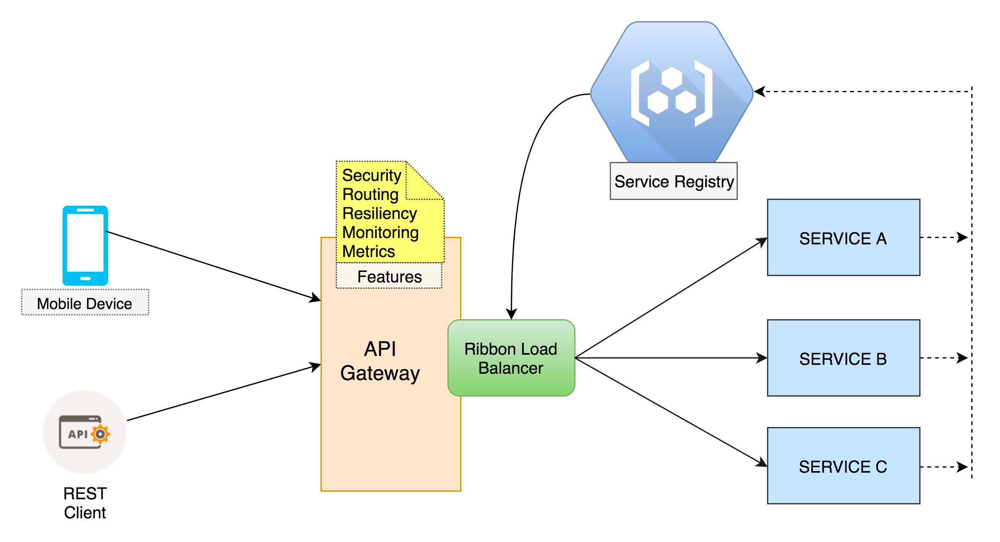

API Gateway
===========

API Gateway is a special class of microservices that meets the need of a single client application (such as android app, web app, angular JS app, iPhone app, etc) and provide it with single entry point to the backend resources (microservices), providing cross cutting concerns to them such as security, monitoring/metrics & resiliency

 

