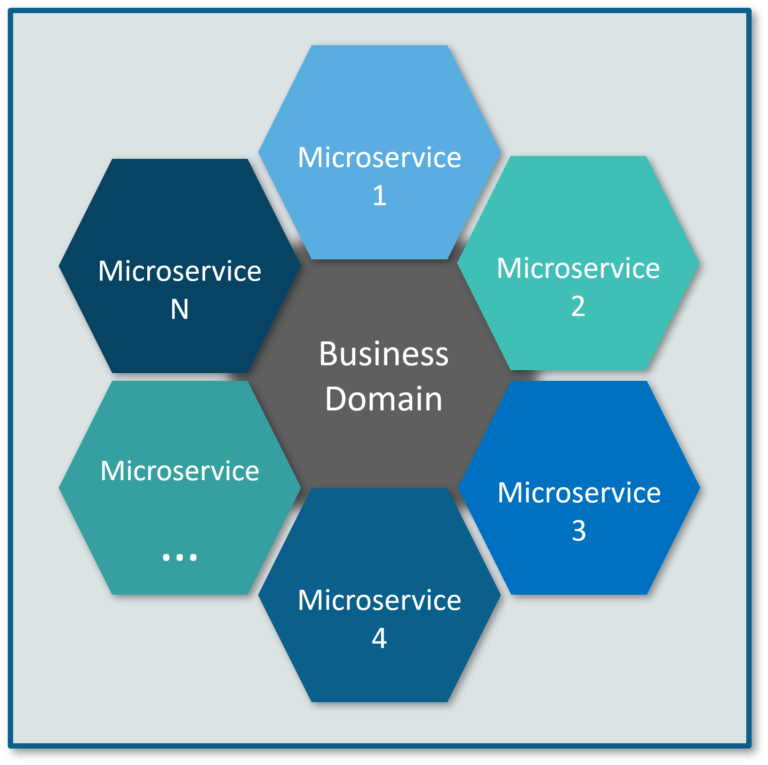
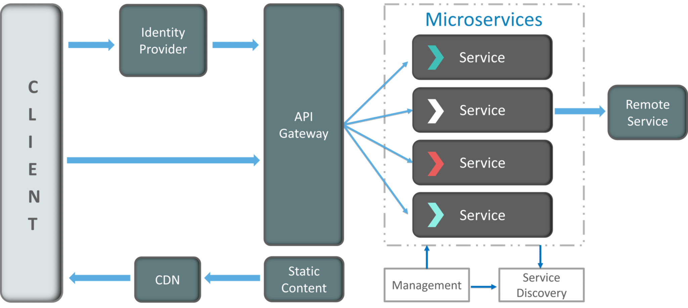

Microservices
=================

Microservices - also known as the microservice architecture - is an architectural style that structures an application as a collection of services that are

- Highly maintainable and testable
- Loosely coupled
- Independently deployable
- Organized around business capabilities
- Owned by a small team

The microservice architecture enables the rapid, frequent and reliable delivery of large, complex applications. It also enables an organization to evolve its technology stack.

What is Micro Service?
> Micro Service is an architecture that allows the developers to develop and deploy services independently. Each service running has its own process and this achieves the lightweight model to support business applications.

 


Advantages of Microservices Architecture
-----------------

In monolithic architecture, applications are built as one large system, whereas in micro-service architecture we divide the application into modular components which are independent of each other.

Monolithic architecture has some advantages:
- Development is quite simple
- Testing a monolith is also simple, just start the application and do the end-to-end testing, Selenium can be used to do the automation testing
- These applications are easier to deploy, as only one single jar/war needs to be deployed
- Scaling is simple when the application size is small, we just have to deploy one more instance of our monolith and distribute the traffic using a load balancer
- Network latency is very low/none because of one single codebase

However, there are various disadvantages of monolith architecture as well:
- Rolling out a new version means redeploying the entire application
- Scaling a monolith application becomes difficult once the application size increases. It also becomes difficult to manage
- The size of the monolith can slow down the application start-up and deployment time
- Continuous deployment becomes difficult
- A bug in any module can bring down the entire application
- It is very difficult to adopt any new technology in a monolith application, as it affects the whole application, both in terms of time and cost

Micro-service architecture gives following advantages: 

- Micro-services are easier to manage as they are relatively smaller in size
- Scalability is a major advantage of using a micro-service architecture, each micro-service can be scaled independently
- Rolling out a new version of micro-service means redeploying only that micro-service
- A bug in micro-service will affect only that micro-service and its consumers, not the entire application
- Micro-service architecture is quite flexible. We can choose different technologies for different micro-services according to business requirements
- It is not that difficult to upgrade to newer technology versions or adopt a newer technology as the codebase is quite smaller (this point is debatable in case the micro-service becomes very large)
- Continuous deployment becomes easier as we only have to re-deploy that micro-service.

Despite all these advantages, Micro-services also comes with various disadvantages:
- As micro-services are distributed, it becomes complex compared to monolith. And this complexity increases with the increase in micro-services
- As micro-services will need to communicate with each other, it increases the network latency. Also, extra efforts are needed for a secure communication between micro-services
- Debugging becomes very difficult as one micro-service will be calling other micro-services and to figure out which micro-service is causing the error, becomes a difficult task in itself
- Deploying a micro-service application is also a complex task, as each service will have multiple instances and each instance will need to be configured, deployed, scaled and monitored
- Breaking down a large application into individual components as micro-services is also a difficult task

We have discussed both advantages and disadvantages of monolith and micro-services, you can easily figure out the differences between them, however, I am also stating them below.

The differences are:

- In a monolithic architecture, if any fault occurs, it might bring down the entire application as everything is tightly coupled, however, in case of micro-service architecture, a fault affects only that micro-service and its consumers
- Each micro-service can be scaled independently according to requirement. For example, if you see that one of your micro-service is taking more traffic, then you can deploy another instance of that micro-service and then distribute the traffic between them. Now, with the help of cloud computing services such as AWS, the applications can be scaled up and down automatically. However, in case of monolith, even if we want to scale one service within the monolith, we will have to scale the entire monolith
- In case of monolith, the entire technology stack is fixed at the start. It will be very difficult to change the technology at a later stage in time. However, as micro-services are independent of each other, they can be coded in any language, taking the advantage of different technologies according to the use-case. So micro-services gives you the freedom to choose different technologies, frameworks etc.
- Deploying a new version of a service in monolith requires more time and it increases the application downtime, however, micro-services entails comparatively lesser downtime 


-----------------
|  Advantage       |  Description  |
| ----------- | ----------- |
| Independent Development |   All microservices can be easily developed based on their individual functionality |
| Independent Deployment |  Based on their services, they can be individually deployed in any application |
| Fault Isolation	 |   Even if one service of the application does not work, the system still continues to function |
| Mixed Technology Stack	 |  Different languages and technologies can be used to build different services of the same application |
| Granular Scaling	 |  Individual components can scale as per need, there is no need to scale all components together |

*  Microservices are self-contained, independent deployment module.
*  The cost of scaling is comparatively less than the monolithic architecture.
*  Microservices are independently manageable services. It can enable more and more services as the need arises. It minimizes the impact on existing service.
* It is possible to change or upgrade each service individually rather than upgrading in the entire application.
* Microservices allows us to develop an application which is organic (an application which latterly upgrades by adding more functions or modules) in nature.
* It enables event streaming technology to enable easy integration in comparison to heavyweight interposes communication.
* Microservices follows the single responsibility principle.
* The demanding service can be deployed on multiple servers to enhance performance.
* Less dependency and easy to test.
* Dynamic scaling.
* Faster release cycle.


Disadvantages of Microservices
-----------------
* Microservices has all the associated complexities of the distributed system.
* There is a higher chance of failure during communication between different services.
* Difficult to manage a large number of services.
* The developer needs to solve the problem, such as network latency and load balancing.
* Complex testing over a distributed environment.


Challenges of Microservices Architecture
-----------------
- **Bounded context**: The bounded context concept originated in Domain-Driven Design (DDD) circles. It promotes the Object model first approach to service, defining a data model that service is responsible for and is bound to. A bounded context clarifies, encapsulates, and defines the specific responsibility to the model. It ensures that the domain will not be distracted from the outside. Each model must have a context implicitly defined within a sub-domain, and every context defines boundaries. In other words, the service owns its data and is responsible for its integrity and mutability. It supports the most important feature of microservices, which is independence and decoupling.

- **Dynamic scale up and scale down**: The loads on the different microservices may be at a different instance of the type. As well as auto-scaling up your microservice should auto-scale down. It reduces the cost of the microservices. We can distribute the load dynamically.

- **Monitoring**: The traditional way of monitoring will not align well with microservices because we have multiple services making up the same functionality previously supported by a single application. When an error arises in the application, finding the root cause can be challenging.

- **Fault Tolerance**: Fault tolerance is the individual service that does not bring down the overall system. The application can operate at a certain degree of satisfaction when the failure occurs. Without fault tolerance, a single failure in the system may cause a total breakdown. The circuit breaker can achieve fault tolerance. The circuit breaker is a pattern that wraps the request to external service and detects when they are faulty. Microservices need to tolerate both internal and external failure.

- **Cyclic Dependency**: Dependency management across different services, and its functionality is very important. The cyclic dependency can create a problem, if not identified and resolved promptly.

- **DevOps Culture**: Microservices fits perfectly into the DevOps. It provides faster delivery service, visibility across data, and cost-effective data. It can extend their use of containerization switch from Service-Oriented-Architecture (SOA) to Microservice Architecture (MSA).

- The traditional logging is ineffective because microservices are stateless, distributed, and independent. The logging must be able to correlate events across several platforms.

- When more services interact with each other, the possibility of failure also increases.

Gateway
-----------------
>  Clients will not directly invoke microservices, they will go through the Gateway. The Gateway in turn can call the microservices and will return the response to the client.
   The Gateway can decouple the microservices from the clients. It will provide functions such as authentication, logging, load balancing etc.


Microservices Monitor
-----------------
> Spring Boot actuator will be a good tool monitor metrics, counters for individual microservices. But if we have multiple microservices, it is difficult to monitor each individually. We will use open source tools such as Prometheous, Kibana or Graphana for this . Prometheous is a pull based monitoring tool and it will contain metrics at provided intervals, displays them and will also trigger alerts. Kibana or Grafana are dashboard tools which are used for visualizing and monitor the data. When there will be large number of microservices with dependencies, we will use AppDynamics, Dynatrace, and New Relic that will draw dependencies among microservices.

Microservices vs Monolithic Architecture
-----------------

- **Microservices**
    - Service Startup is fast
    - Microservices are loosely coupled architecture.
    - Changes done in a single data model does not affect other Microservices.
    - Microservices focuses on products, not projects

- **Monolithic Architecture**
    - Service startup takes time
    - Monolithic architecture is mostly tightly coupled.
    - Any changes in the data model affect the entire database
    - Monolithic put emphasize over the whole project


How does Microservice Architecture work?
-----------------
A microservice architecture has the following components:

- **Clients** – Different users from various devices send requests.
- **Identity Providers** – Authenticates user or clients identities and issues security tokens.
- **API Gateway** – Handles client requests.
- **Static Content** – Houses all the content of the system.
- **Management** –  Balances services on nodes and identifies failures.
- **Service Discovery** – A guide to find the route of communication between microservices.
- **Content Delivery Networks** – Distributed network of proxy servers and their data centers.
- **Remote Service** – Enables the remote access information that resides on a network of IT devices.





Communicating Between Microservices
-----------------

There are two types of inter-service communication in Microservices:

 1. **Synchronous communication** : one service will communicate with another service through the rest endpoint using HTTP or https protocol. In this approach, calling service will wait until the caller service responds.
 2. **Asynchronous communication** : one service will communicate with another service through the asynchronous messaging. The calling service will not wait to respond by the caller service. First, it will return a response to the user, then the remaining services will process the request. Asynchronous communication in Microservices will be achieved through the messaging brokers like Apache Kafka, Apache ActiveMQ, etc.


SOAP vs REST
-------------
The differences are:
- SOAP stands for Simple Object Access Protocol and REST stands for Representational State Transfer
- SOAP is a protocol whereas REST is an architectural style
- SOAP cannot use REST because it is a protocol whereas REST can use SOAP web services as the underlying protocol, because it is just an architectural pattern
- SOAP uses service interfaces to expose its functionality to client applications whereas REST uses URI to expose its functionality
- SOAP defines standards that needs to be strictly followed for communication to happen between client and server whereas REST does not follow any strict standard
- SOAP requires more bandwidth and resources than REST because SOAP messages contain a lot of information whereas REST requires less bandwidth than SOAP because REST messages mostly just contains a simple JSON message
- SOAP only works with XML format whereas REST allows different data formats like Plain text, HTML, XML, JSON etc.
- SOAP defines its own security whereas REST inherits the security 

Eureka Naming Server
-------------
let’s consider an example. Suppose you have 5 micro-services which are experiencing heavy traffic and you want to deploy multiple instances of these 5 micro-services and use a load balancer to distribute the traffic among these instances. Now, when you create new instances of your micro-service, you have to configure these in your load balancer, so that load balancer can distribute traffic properly. Now, when your network traffic will reduce then you will most likely want to remove some instances of your micro-service, means you will have to remove the configuration from your load balancer. I think, you see the problem here.

This manual work that you are doing can be avoided by using Eureka naming server. Whenever a new service instance is being created/deleted, it will first register/de-register itself to the Eureka naming server. Then you can simply configure a Ribbon client (Load Balancer) which will talk with Eureka Naming server to know about the currently running instances of your service and Ribbon will properly distribute the load between them. Also, if one service, serviceA wants to talk with another service, serviceB then also Eureka Naming server will be used to know about the currently running instances of serviceB.
You can configure Eureka Naming Server and Ribbon client in SpringBoot very easily. 


Zuul
-----
Zuul is an API gateway server. It handles all the requests that are coming to your application. As it handles all the requests, you can implement some common functionalities of your micro-services as part of Zuul server like Security, Monitoring etc. You can monitor the incoming traffic to gain some insights and also provide authentication at a single place rather than repeating it in your services. Using Zuul, you can dynamically route the incoming requests to the respective micro-services. So, the client doesn’t have to know about the internal architecture of all the services, it will only call the Zuul server and Zuul will internally route the request.


Zipkin
-----
To understand Zipkin use-case, let’s consider an example. Suppose you have a chain of 50 micro-services where first micro-service is calling the second and second calling third and so on. Now, if there is an error in, say 35th micro-service, then how you will be able to identify your request that you made to the first micro-service, from all the logs that gets generated in all 35 micro-services. I know this is an extreme example

Zipkin helps in distributed tracing, especially in a micro-service architecture. It assigns an ‘id’ to each request and gives you a dashboard, where you can see the complete request and a lot more details, like the entire call-chain, how much time one micro-service took and which service failed etc.

Hysterix
-----
Hysterix is a library that makes our micro-service, fault-tolerant. Suppose, you have a chain of 10 micro-services calling each other and the 6th one fails for some reason, then your application will stop working until the failed micro-service is fixed.

You can use Hysterix here and provide a fallback method in case of a service failure.

```java
@GetMappinng("/getByName/{name}")
@HystrixCommannd(fallbackMethod = "handlerMethod")
public String.  getMapping(@PathVariable String name){
    return "Get";
}

public String handleMethod(){
    return "Service is down";
}
```

If the GET service is getting failed, then the fallback method will be executed.


For more information:
1. [Top 50 Microservices Interview Questions You Must Prepare In 2020](https://www.edureka.co/blog/interview-questions/microservices-interview-questions/)
2. [Top 25 Microservices Interview Questions and Answers](https://www.guru99.com/microservices-interview-questions.html)
3. [Microservices Tutorial](https://www.javatpoint.com/microservices)
4. [Microservices Inter-Service Communication](https://www.dineshonjava.com/microservices-inter-service-communication/)

