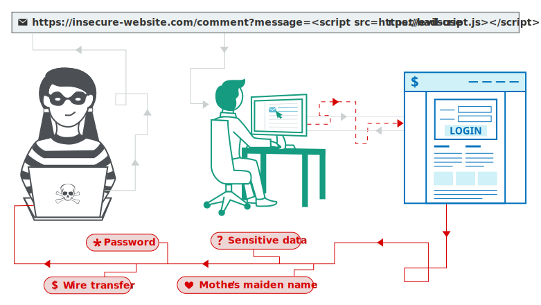

Common Java Vulnerabilities 
============

Injection Flaws
------
Injection flaws, particularly SQL injection, are common in Java EE applications. Injection occurs when user-supplied data is sent to an interpreter as part of a command or query. The attacker’s hostile data tricks the interpreter into  executing unintended commands or changing data.

**Primary Defenses:**
Option 1: Use of Prepared Statements (with Parameterized Queries)
Option 2: Use of Stored Procedures
Option 3: Allow-list Input Validation
Option 4: Escaping All User Supplied Input

**Additional Defenses:**
Also: Enforcing Least Privilege
Also: Performing Allow-list Input Validation as a Secondary Defense

Cross Site Scripting (XSS)
------------
Cross-Site Scripting (XSS) attacks are a type of injection, in which malicious scripts are injected into otherwise benign and trusted websites. XSS attacks occur when an attacker uses a web application to send malicious code, generally in the form of a browser side script, to a different end user. Flaws that allow these attacks to succeed are quite widespread and occur anywhere a web application uses input from a user within the output it generates without validating or encoding it.

An attacker can use XSS to send a malicious script to an unsuspecting user. The end user’s browser has no way to know that the script should not be trusted, and will execute the script. Because it thinks the script came from a trusted source, the malicious script can access any cookies, session tokens, or other sensitive information retained by the browser and used with that site. These scripts can even rewrite the content of the HTML page.

Types of XSS attacks

There are three main types of XSS attacks. These are:

**Reflected XSS** :  where the malicious script comes from the current HTTP request.
**Stored XSS** :  where the malicious script comes from the website's database.
**DOM-based XSS** : where the vulnerability exists in client-side code rather than server-side code.

How does XSS work?
------------
Cross-site scripting works by manipulating a vulnerable web site so that it returns malicious JavaScript to users. When the malicious code executes inside a victim's browser, the attacker can fully compromise their interaction with the application.

Cross Site Request Forgery(CSRF)
------

For more information:
1. [SQL Injection Prevention Cheat Sheet](https://cheatsheetseries.owasp.org/cheatsheets/SQL_Injection_Prevention_Cheat_Sheet.html)
2. [Cross Site Scripting Prevention Cheat Sheet](https://cheatsheetseries.owasp.org/cheatsheets/Cross_Site_Scripting_Prevention_Cheat_Sheet.html)
3. [Cross-site scripting](https://portswigger.net/web-security/cross-site-scripting)

