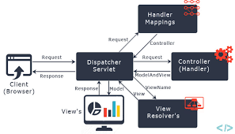

Spring MVC
==========

Spring MVC flow
--------------
In Spring Web MVC, `DispatcherServlet` class works as the front controller. It is responsible to manage the flow of the spring mvc application.

The `@Controller` annotation is used to mark the class as the controller in Spring 3.

The `@RequestMapping` annotation is used to map the request url. It is applied on the method.

Spring MVC Execution Flow
--------------
- **Step 1:** First request will be received by DispatcherServlet.
- **Step 2:** DispatcherServlet will take the help of HandlerMapping and get to know the Controller class name associated with the given request.
- **Step 3:** So request transfer to the Controller, and then controller will process the request by executing appropriate methods and returns ModelAndView object (contains Model data and View name) back to the DispatcherServlet.
- **Step 4:** Now DispatcherServlet send the model object to the ViewResolver to get the actual view page.
- **Step 5:** Finally DispatcherServlet will pass the Model object to the View page to display the result.

 


Spring Web Annotations
--------------

@RequestMapping
--------------

it can be configured using:

- path, or its aliases, name, and value: which URL the method is mapped to
- method: compatible HTTP methods
- params: filters requests based on presence, absence, or value of HTTP parameters
- headers: filters requests based on presence, absence, or value of HTTP headers
- consumes: which media types the method can consume in the HTTP request body
- produces: which media types the method can produce in the HTTP response body

Example: 
```java
@Controller
class VehicleController {

    @RequestMapping(value = "/vehicles/home", method = RequestMethod.GET)
    String home() {
        return "home";
    }
}
```

this configuration has the same effect :

```java
@Controller
@RequestMapping(value = "/vehicles", method = RequestMethod.GET)
class VehicleController {

    @RequestMapping("/home")
    String home() {
        return "home";
    }
}

```

Moreover, @GetMapping, @PostMapping, @PutMapping, @DeleteMapping, and @PatchMapping are different variants of @RequestMapping with the HTTP method already set to GET, POST, PUT, DELETE, and PATCH respectively.

These are available since Spring 4.3 release.

@RequestBody
-----------
maps the body of the HTTP request to an object.The deserialization is automatic and depends on the content type of the request.
```java
@PostMapping("/save")
void saveVehicle(@RequestBody Vehicle vehicle) {
    // ...
}
```

@PathVariable
-----------
```java

```

@RequestParam
-----------
```java


```

Response Handling Annotations

@ResponseBody
-----------
```java

```

@ExceptionHandler
-----------
```java

```

@ResponseStatus
-----------
```java

```

Other Web Annotations

@Controller
-----------
```java

```

@RestController
-----------

@ModelAttribute
-----------

@CrossOrigin
-----------


For more information:

1. [Spring MVC flow with Example](https://codenuclear.com/spring-mvc-flow-with-example/)
2. [Spring Web Annotations](https://www.baeldung.com/spring-mvc-annotations)


